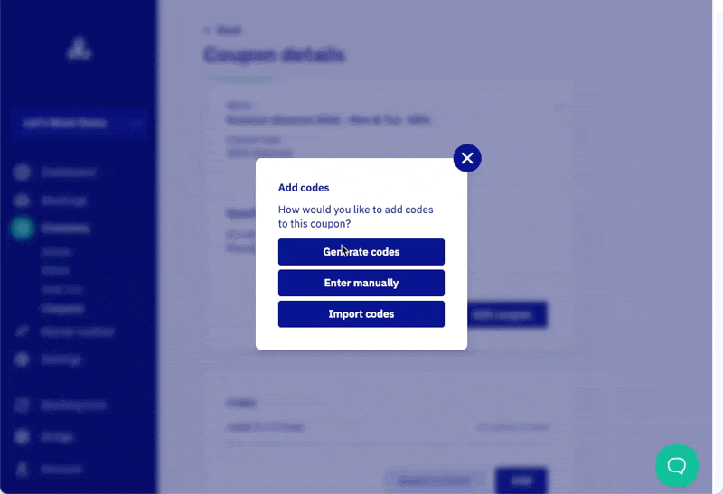

# Create discount codes

Coupons are a great way to offer special deals or discounts to customers. You can create and manage [coupons](https://dashboard.letsbook.app/coupons) in the inventory section.

## Two-step process

**Important:** Creating coupons is a two-step process:

1. **First:** Create the coupon with discount type and conditions
2. **Then:** Add the specific codes that customers can use

## Step 1: Create a new coupon

### Enter title

Go to [add new coupon](https://dashboard.letsbook.app/coupons/add) and name your coupon.

**Tip:** Use the title to briefly describe the discount. For example: "Summer discount 2026 - Mon & Tue -30%"

### Choose coupon type

You have three discount options:

- **Free time:** Gives customers free minutes/hours on their booking
- **Percentage discount:** Reduces total price by a percentage (e.g., 20% off)
- **Amount discount:** Reduces total price by a fixed amount

### Set conditions (optional)

By default, coupons are always valid. However, you can add conditions to make them more specific:

- **Boats:** Restrict to specific boat models or types
- **Docks:** Limit to certain dock locations
- **Dates:** Set start and end dates for the coupon period
- **Times:** Specify time ranges (e.g., only morning bookings)
- **Days:** Restrict to certain weekdays (e.g., Monday-Tuesday only)
- **Duration:** Set minimum or maximum trip lengths
- **Exception dates:** Exclude specific dates when coupon shouldn't work

## Step 2: Add coupon codes

After creating your coupon, you need to add the actual codes that customers will use. You have three options:

### Generate codes (recommended for multiple codes)

- Best option when you want many different codes
- Choose how many codes to generate
- Set usage limit per code (how many times each code can be used)
- Specify code format and length

### Enter manually

- Perfect for creating a single code for a large group
- Enter your own custom code
- Set how many times it can be used

### Import codes

- Upload codes from Excel file
- Copy and paste multiple codes into text field
- Gives you complete control over code format
- Helpful for adding large numbers of codes

## Managing your coupons

### Export codes

1. Go to the [coupons section](https://dashboard.letsbook.app/coupons)
2. Find the coupon whose codes you want to export
3. Click on the coupon to open its detail page
4. Use the export button to download codes to Excel

**Use cases for exports:**

- Finding a specific code quickly
- Sending to print shops for physical coupons
- Sharing codes with marketing teams

## Best practices

- **Clear naming:** Use descriptive titles that explain the discount and conditions
- **Test first:** Create a test coupon with one code to verify it works as expected
- **Monitor usage:** Keep track of how many times codes are being used
- **Set limits:** Use usage limits to control how often codes can be redeemed
- **Plan ahead:** Set up date ranges for seasonal promotions
