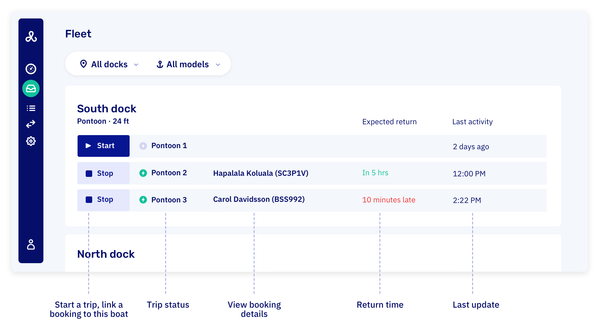

# Working with fleet view

The fleet view mirrors what's actually happening at your dock — every physical boat, its current status, and who's on it. It's the go-to interface for linking boats to bookings, managing handouts, and spotting overdue returns.

## Accessing fleet view

Go to your [fleet view](https://dashboard.letsbook.app/fleet) to see the current status of all your boats. Filter by dock or boat model using the buttons at the top.

## What you see

**Current status of each boat:**

- **Green dots**: Active trips in progress
- **Red dots**: Overdue rentals (with delay time like "+5 min.")
- **Grey/No dot**: Available boats ready for rental

## Quick actions

**Start trip** - Link a trip to an existing booking, then start it directly from the fleet view

**Stop trip** - End an active rental and mark the boat as returned

**Click boats** - Click any boat to see full trip details and customer information

## Connected fleet

With [connected fleet](/guides/settings/boats/connect-boats), starting or stopping a trip also physically activates or deactivates the boat's engine — no separate step needed at the dock.
