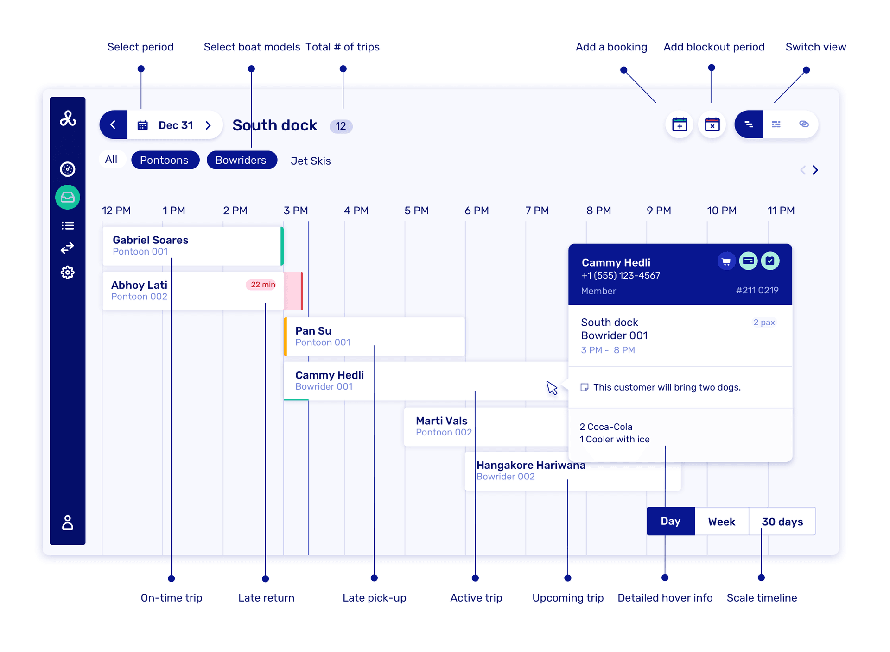
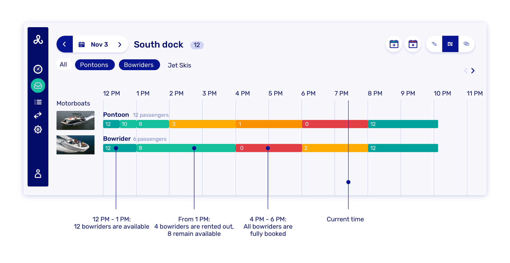
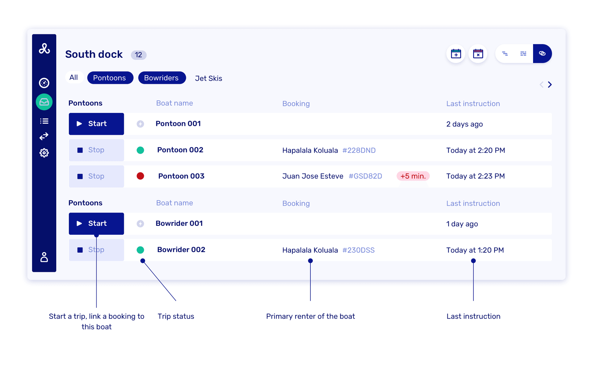

# Working with the planning overview

Use the planning overview to run daily operations. Switch between three views to manage bookings, monitor your availability and manage your fleet.

## Accessing planning overview

Go to your [planning overview](https://dashboard.letsbook.app/planning) to see all your operational views in one place. Use the date picker to jump to specific dates, navigate with arrow buttons for day-by-day browsing, or use quick shortcuts for "Today" and "Tomorrow".

## The three views

Switch between the three planning views using the tabs.

### Timeline view

Your detailed booking schedule showing exact trip timing and customer information.

**What you see:**

- All bookings arranged chronologically by pickup time
- Customer names and booking details with customer type indicators
- Boat assignments and trip status with color-coded indicators:
    - **White/Default bars**: Standard confirmed bookings
    - **Green indicators**: On-time active trips
    - **Red indicators**: Overdue returns (with delay time like "+15 min.")
    - **Orange indicators**: Late pick-ups or delayed starts
- Interactive booking cards with customer details and trip information
- Boat model assignments clearly displayed (Bowrider, Pontoon, etc.)

**Interactive features:**

- Click on bookings to see its details
- Hover for quick booking information
- Switch between Day, Week, and 30 Days view using the controls in bottom right
- Use dock selector to filter by location (e.g., "Marina Bay", "Sunset Harbor", "Crystal Lake Marina", "South Dock") or select "All docks"
- Filter by specific boat types using the boat model buttons
- **Add booking**: Create new bookings directly from the planning view
- **Add blockout period**: Block availability for maintenance, events, or closures

Perfect for tracking individual bookings throughout the day, managing customer service and special requests, coordinating multiple trips at once, and quickly identifying late returns or pick-ups.

:::info[Tip]
You can scroll horizontally by dragging or using the mouse wheel while holding down the shift button.
:::

### Availability view

Visual representation of your fleet capacity and utilization.

**What you see:**

- Time-based chart showing boat availability throughout the day
- Color-coded capacity bars:
    - **Green**: Available boats
    - **Orange/Yellow**: Partially booked capacity
    - **Red**: Fully booked time slots
- Numbers indicating exact boat counts available at each time
- Capacity breakdown explanations (e.g., "4 bowriders are rented out, 8 remain available")
- Current time indicator showing real-time status
- Boat type tabs for filtering specific models

Ideal for spotting high-demand periods and availability gaps, making quick capacity decisions, identifying opportunities for additional bookings, and understanding fleet utilization patterns.

### Fleet view

Real-time status of all your individual boats.

**What you see:**

- Current status of each physical boat with Start/Stop buttons
- Trip status indicators:
    - **Green dots**: Active trips in progress
    - **Red dots**: Overdue rentals (with delay time like "+5 min.")
    - **Grey/No dot**: Available boats ready for rental
- Primary renter information for boats currently in use
- Last instruction timestamps showing recent activity
- Immediate action buttons to start trips or stop active rentals
- Boat model and identification clearly labeled

Essential for managing boat handouts and returns, tracking overdue rentals with precise delay information, starting trips directly from available boats, and getting complete fleet status at a glance.

The planning overview adapts to your operational needs, whether you're managing a single dock with a few boats or multiple locations with large fleets.
