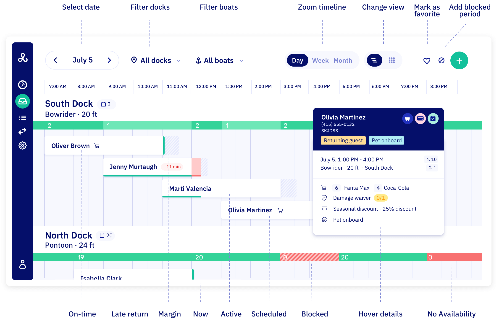
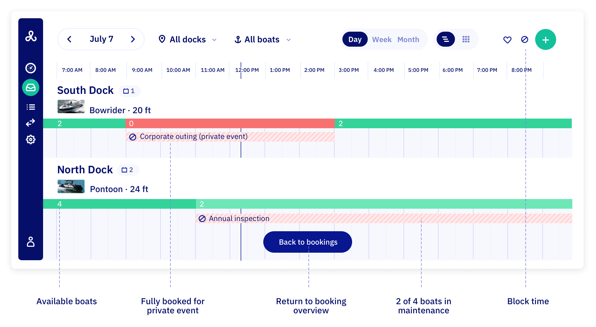

import InlineVideoPlayer from '@site/src/components/InlineVideoPlayer';

import planningWalkthrough from './graphics/planning_overview_walkthrough.mp4';

# Working with the planning overview

## Video walkthrough {#walkthrough}

In 2 minutes, see exactly how the planning overview works.

<InlineVideoPlayer videoSrc={planningWalkthrough} playButton />

Your planning overview shows everything you need to run daily operations: boat availability, booking margins, blocks, and all your trips in one timeline view.

## Accessing planning overview

Go to your [planning overview](https://dashboard.letsbook.app/planning) to see your complete operational picture. Use the date picker to jump to specific dates, navigate with arrow buttons for day-by-day browsing, or use quick shortcuts for "Today" and "Tomorrow".

## What you see

**Availability bars per boat model** - Green bars show available boats, red means fully booked. See capacity for each hour without clicking around.

**Booking margins** - Prep time before trips and buffer time after appear directly in the timeline. Spot exactly when late returns will cause problems.

**Block periods** - Maintenance blocks, private events, and downtime show up in your timeline so you never accidentally overbook.

**All bookings** - Every trip arranged chronologically with customer names, boat assignments, and color-coded status:

- **On-time** - Active trips running on schedule
- **Late return** - Overdue trips, with delay shown directly on the bar (e.g. "+11 min")
- **Active** - Trip currently in progress
- **Scheduled** - Upcoming confirmed bookings
- **Blocked** - Blockout periods for maintenance or events

**Hover details** - Hover any booking to see the full picture: customer labels like "Returning guest" or "Pet onboard", add-ons ordered, waiver status, active discounts, and trip details.

:::info[Tip]
You can scroll horizontally by dragging or using the mouse wheel while holding down the shift button.
:::

## Availability view

Click any availability bar to switch to the availability view. This shows you exactly how many boats are available per time slot and what's causing any blocks.

The number in each bar is the count of available boats at that moment. A **0** means fully blocked — no boats available. Partial blocks show a reduced number, like 2 out of 4 boats still available during an inspection.

Blocked periods appear as striped red bars with the block name directly on them, so you can see at a glance whether it's a "Corporate outing" taking all boats or routine maintenance on just part of your fleet. To add or edit blocks, go to [manage blockout periods](/guides/day-to-day/blockout-periods#in-planning-overview).

Use **Back to bookings** to return to the regular planning view.
