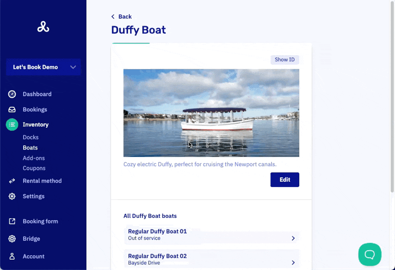
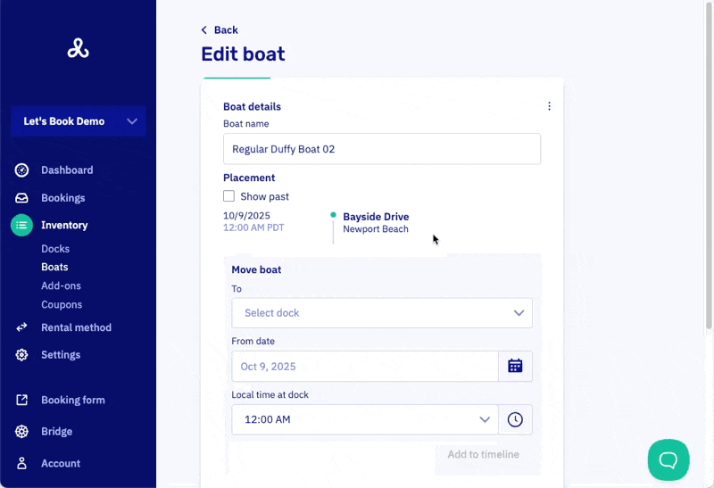

# Assign boats to docks and manage placement

Once you've created boat models, you need to assign individual boats to specific docks and manage their locations over time. Let's Book provides flexible tools for both batch assignments and individual boat placement.

## Assigning boats to docks

### Batch assignment

For efficiency when multiple boats of the same model need to go to the same dock:

1. Go to your [boat models page](https://dashboard.letsbook.app/models)
2. Select the boat model you want to assign
3. Click "Batch assign to dock"
4. Choose the dock where all boats of this model should be placed
5. Set the date and time when this assignment takes effect

### Individual boat assignment

For specific placement of individual boats:

1. From the boat models page, click on the specific boat you want to assign
2. Navigate to the "Placement" section
3. Set when and where the boat should be located
4. View the complete timeline of the boat's scheduled locations

## Managing boat placement

### Understanding the timeline view

The Placement section shows you a timeline of where each boat will be positioned. This gives you a complete overview of:

- Current boat location
- Scheduled moves and relocations
- Historical placement data
- Future placement plans

### Moving boats between docks

To schedule a boat relocation:

1. In the boat's edit page, go to "Move boat" section
2. Select the destination dock from the "To" dropdown
3. Set the "From date" when the move should happen
4. Choose the "Local time at dock" for the move
5. Click "Add to timeline" to schedule the move

**Important:** The boat remains available for booking at its original location until the scheduled move date and time.

## Taking boats out of service

When boats need maintenance, repairs, or seasonal storage:

1. Follow the same placement steps as moving boats
2. Instead of selecting a specific dock, choose "Out of service"
3. Set the start date and time
4. If you know when maintenance will be completed, set an end time - this allows the boat to be booked for future dates after the service period
5. The boat will appear as unavailable for booking during this period

Common reasons to take boats out of service:

- Scheduled maintenance and repairs
- Seasonal storage (winter months)
- Safety inspections
- Damage requiring repair time

This placement system gives you complete control over your fleet location and availability, ensuring boats are where they need to be when customers want to book them.
