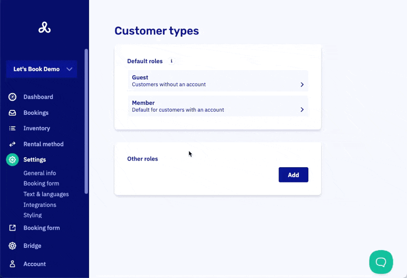

# Set booking and cancellation rules

Set up booking restrictions and cancellation policies for different customer types. These rules automatically apply when customers make reservations, ensuring your operational requirements are met.

## Understanding customer types

Every Let's Book setup starts with two default customer types:

**Guest** - Customers without an account who book as visitors. They receive booking confirmations via email but cannot log in to view their bookings.

**Member** - Originally a guest who created an account during the booking process. Members can log into Let's Book to view, modify, and manage their bookings through their personal dashboard.

You can create additional custom customer types with specific rules, but these two form the foundation of your booking system.

## Accessing the settings

1. Go to your [customer types](https://dashboard.letsbook.app/customer-types)
2. Click on the customer type you want to configure (Guest, Member, etc.)
3. Scroll down to the **Booking conditions** and **Cancellation settings** sections

## Setting up booking conditions

By default, bookings are unrestricted. You can add multiple conditions that work together:

1. Click **Add condition**
2. Select the first condition type from the dropdown
3. Configure the specific parameters (times, numbers, dates)

To add multiple restrictions, click **Add condition** again to layer additional rules. All conditions must be satisfied for the booking to be allowed.

Conditions are combined with "and" logic - customers must meet every condition you set.

### Available booking conditions

- **Allowed dock and boat model combination** - Restrict which boats can be booked at specific docks
- **Allowed days of the week** - Limit bookings to certain days (e.g., weekends only)
- **Excluded dates** - Block specific dates from being booked
- **Minimum time booked ahead** - Require advance booking (e.g., 24 hours minimum)
- **Maximum time booked ahead** - Prevent too-far-ahead bookings (e.g., max 30 days)
- **Maximum booking duration** - Limit rental length (e.g., max 4 hours)
- **Maximum number of bookings on the same day** - Prevent multiple same-day rentals
- **Maximum number of boats per booking** - Limit fleet size per reservation
- **Maximum number of future bookings** - Control total active reservations per customer
- **Maximum total duration of bookings in the future** - Limit total reserved time
- **Maximum total booking duration per month** - Monthly usage caps
- **Maximum total booking duration on specific days of the week per month** - Weekend/weekday limits
- **Custom condition** - Advanced rules using expressions. For complex scenarios, see [custom booking conditions](../dive-deeper/custom-booking-conditions) where you can create highly specific rules using code expressions.

## Control advance booking time

**Minimum time booked ahead**
Require advance booking to give yourself prep time. Set 2 hours for quick operations, 24 hours for standard rentals, or 7 days for specialized charters.

**Maximum time booked ahead**
Limit how far ahead customers can book. Common settings: 30 days for seasonal ops, 90 days for standard operations, 180+ days for event bookings.

**Combining both:** Set a booking window, like "between 24 hours and 90 days in advance."

## Configuring cancellation settings

### Basic cancellation control

Toggle **"Allow customers of this type to cancel"** to enable/disable cancellation rights.

### Cancellation message

Customize the message customers see when cancelling. Use this to explain your cancellation policy and any associated costs (e.g., "Cancellations within 24 hours incur a 25% processing fee").

**Cancellation conditions (optional)**
Set time requirements like minimum 24 hours notice before pickup.

## Important notes

- Changes to conditions affect new bookings immediately
- Existing bookings remain unaffected by rule changes
- The system won't automatically refund cancelled bookings - handle refunds manually if needed
- Test your conditions with different scenarios to ensure they work as expected

These rules help automate your booking policies and ensure customers book within your operational guidelines.
