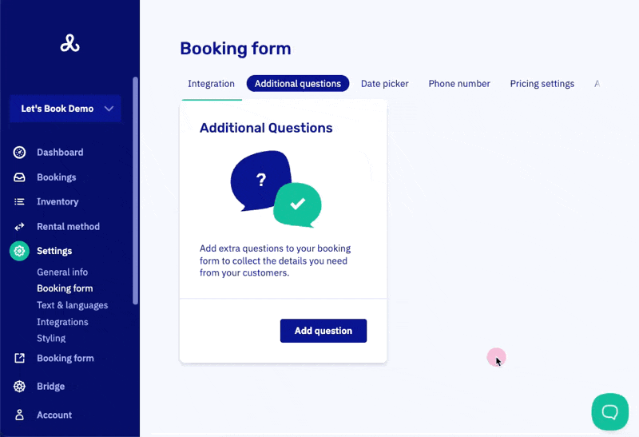

# Customize additional questions

Personalize the booking process by adding custom questions to collect details that are not part of the default form. Think experience level, special requests or preferences, the occasion, or whether guests will bring a dog.

:::note
Answers are stored for up to 2 weeks after the trip.
:::

## How it works

Go to [Booking Form > Additional questions > Add question](https://dashboard.letsbook.app/booking-form/additional-questions/add). Fill in:

- The question (e.g., "Dietary requirements?")
- Optional hint text visible in the answer field (e.g., "vegetarian, gluten-free")
- Save.

## Options

### Required

Mark whether the question is required. If not required, the form shows an "(optional)" indicator.

### Sensitive data

Flag answers that may include private or delicate data. Examples include health information, identification numbers, and payment details. Let's Book securely stores this data in line with data protection regulations.

If one or more questions are flagged as sensitive, the form shows an extra consent checkbox. Sensitive answers are only visible in the dashboard, not in the booking confirmation email.

:::warning
You are responsible for using this information only for its intended purpose and in line with applicable laws. Always obtain explicit consent from customers before collecting such data.
:::

### Specific cases

Show the question only when the booking matches specific criteria:

- Dock(s)
- Boat model(s)
- Customer type(s)

## Rearranging questions

Click [rearrange](https://dashboard.letsbook.app/booking-form/additional-questions/rearrange) to drag and drop questions into a logical flow.
