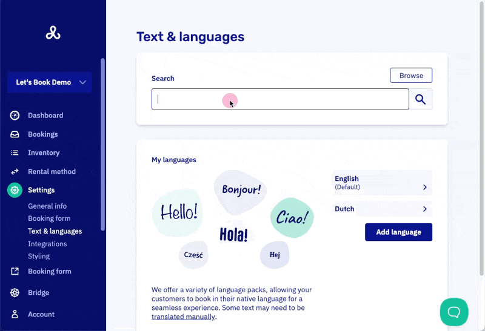
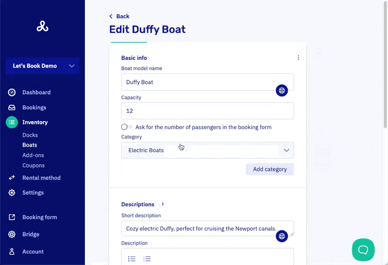

# Modify texts and translations

You can customize all text that your customers see to match your own style and preferences. Go to text & languages. Use [search](https://dashboard.letsbook.app/localization) or [browse](https://dashboard.letsbook.app/localization/browse) to find the desired word or phrase. At the 'edit' section, you will find the reference and editable text fields.

Sometimes, a translation contains a variable. It will be displayed between curly braces. e.g. `{variableName}`. You should not translate or change these variables.

## Translating your inventory

Want Copenhagen in English and København in Danish? No problem. You can create translations for [docks](https://dashboard.letsbook.app/docks), [boat models](https://dashboard.letsbook.app/models) or [add-ons](https://dashboard.letsbook.app/add-ons) directly in the screens where you manage them.

Look for the globe icon under the input field to access all activated languages and edit their translations.

## Translating notifications and pricing

In [notifications](https://dashboard.letsbook.app/notifications), you'll find tabs to edit all your emails and text messages in your languages. The same goes for [pricing lines](https://dashboard.letsbook.app/pricing).

## Using variables

- Simply click the green button (+) and select the desired variable.
- In the notifications section, where you manage your emails, you can take it a step further: add buttons, images, and content blocks for a more polished and engaging message.

