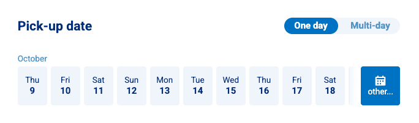
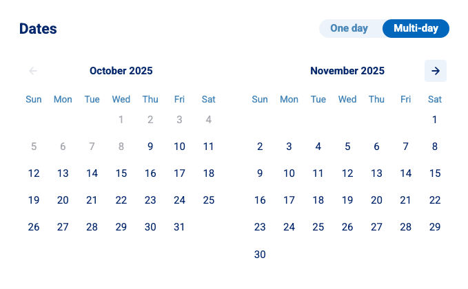

# Tweak the form

## Date picker

Set the calendar to match how you rent. Customers can still switch between single day and multi day on the form.

- Go to [Booking form > Date picker](https://dashboard.letsbook.app/booking-form/date-picker)
- Pick one, then click Save
    - Smart (default): Lets Book chooses the best view per rental. Not sure? Leave it on Smart. Set it once and get back to the fun part of running a marina.
    - Primarily single day: Best if most bookings are hourly or same‑day.
    - Primarily multi day: Best for weekend or multi day charters.

**Single day view:**

**Multi day view:**

### Unavailable dates

Your form knows what's free before customers click. Dates without any availability grey out in every date picker, single day and multi day alike. Once a date is picked, docks, boat models, and group sizes that can't be booked on that date grey out too, with a short note saying so.

:::danger TODO: screenshot

The booking form date picker with a few greyed-out dates, and if it fits, the boat model step with one model greyed out and its note. Save it as `../graphics/unavailable_dates.png`.

:::

Nothing to set up. Availability follows your schedules, blockouts, and existing bookings automatically. And if a spot fills up while a customer is still composing, the form flags the conflict before they submit.

Customers who still run into a full day get [alternatives](/guides/settings/booking-form/alternatives) suggested as before.

## Phone number

Control whether customers must enter a phone number at checkout.

- Go to [Booking form > Phone number](https://dashboard.letsbook.app/booking-form/phone-number-requirement)
- Choose the field rule, then click Save
    - Required: Pick this if you coordinate last minute changes or dockside handoffs. This is the default for new accounts.
    - Optional: Keeps checkout fast for quick bookings.
    - Hidden: Use this if you collect numbers in your waiver or CRM instead.

Already using Let's Book? Your current choice stays as it is.

## Tax / VAT settings

Set how prices appear to customers on the booking form.

- Go to [Booking form > Pricing settings](https://dashboard.letsbook.app/booking-form/pricing-settings)
- Choose how prices are displayed, then click Save
    - Including tax: Show prices with tax included everywhere while composing a booking. Easiest for most operators.
    - Excluding tax: Show prices before tax during booking. Customers see the final total, including tax, on the last step of the booking form. Often used by American companies.
