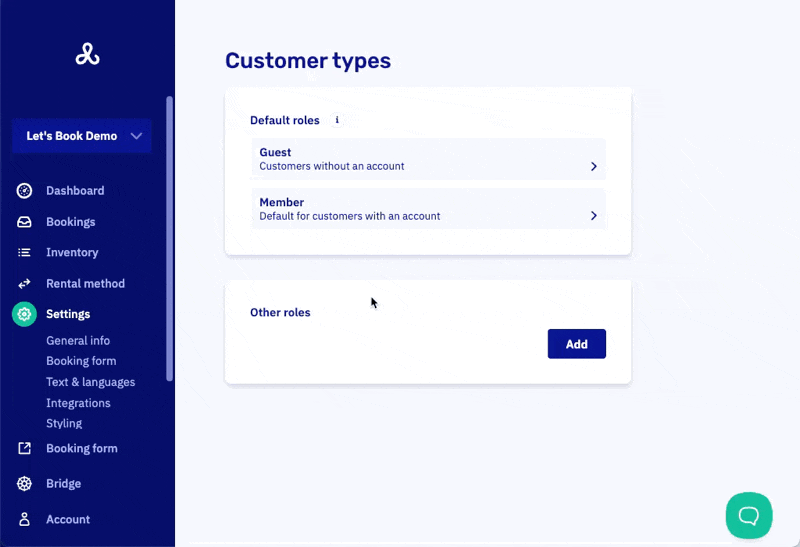

# Set booking and cancellation rules

Set up booking restrictions and cancellation policies for different customer types. These rules automatically apply when customers make reservations, ensuring your operational requirements are met.

## Quick access

Go to your [customer types](https://dashboard.letsbook.app/customer-types), click on any type (Guest, Member, or custom), then scroll to **Booking conditions** and **Cancellation settings**.

## Setting up booking conditions

By default, bookings are unrestricted. You can add multiple conditions that work together:

1. Click **Add condition**
2. Select the condition type from the dropdown
3. Configure the specific parameters (times, numbers, dates)

To add multiple restrictions, click **Add condition** again to layer additional rules. All conditions must be satisfied for the booking to be allowed.

Conditions are combined with "and" logic - customers must meet every condition you set.

### Available booking conditions

- **Allowed dock and boat model combination** - Restrict which boats can be booked at specific docks
- **Allowed days of the week** - Limit bookings to certain days (e.g., weekends only)
- **Excluded dates** - Block specific dates from being booked
- **Minimum time booked ahead** - Require advance booking (e.g., 24 hours minimum)
- **Maximum time booked ahead** - Prevent too-far-ahead bookings (e.g., max 30 days)
- **Maximum booking duration** - Limit rental length (e.g., max 4 hours)
- **Maximum number of bookings on the same day** - Prevent multiple same-day rentals
- **Maximum number of boats per booking** - Limit fleet size per reservation
- **Maximum number of future bookings** - Control total active reservations per customer
- **Maximum total duration of bookings in the future** - Limit total reserved time
- **Maximum total booking duration per month** - Monthly usage caps
- **Maximum total booking duration on specific days of the week per month** - Weekend/weekday limits
- **Custom condition** - Advanced rules using expressions. For complex scenarios, see [custom booking conditions](../dive-deeper/custom-booking-conditions) where you can create highly specific rules using code expressions.

## Control advance booking time

**Minimum time booked ahead**
Require advance booking to give yourself prep time. Set 2 hours for quick operations, 24 hours for standard rentals, or 7 days for specialized charters.

**Maximum time booked ahead**
Limit how far ahead customers can book. Common settings: 30 days for seasonal ops, 90 days for standard operations, 180+ days for event bookings.

**Combining both:** Set a booking window, like "between 24 hours and 90 days in advance."

## Configuring cancellation settings

### Basic cancellation control

Toggle **"Allow customers of this type to cancel"** to enable/disable cancellation rights.

### Cancellation message

Customize the message customers see when cancelling. Use this to explain your cancellation policy and any associated costs (e.g., "Cancellations within 24 hours incur a 25% processing fee").

**Cancellation conditions (optional)**
Set time requirements like minimum 24 hours notice before pickup.

## Common configurations

### Boat club members
- Book up to 14 days ahead
- Maximum 1 booking per day
- Free cancellation up to 2 hours before pickup
- No payment required during booking

### Casual renters
- Must book at least 2 hours ahead
- Maximum 4-hour rental duration
- Cancellation allowed up to 24 hours before pickup
- Full payment required during booking

### Corporate clients
- Book up to 90 days ahead
- Maximum 8 hours per booking
- Maximum 40 hours total per month
- Flexible cancellation with custom terms

## Important notes

- Changes to conditions affect new bookings immediately
- Existing bookings remain unaffected by rule changes
- The system won't automatically refund cancelled bookings - handle refunds manually if needed
- Test your conditions with different scenarios to ensure they work as expected

These rules help automate your booking policies and ensure customers book within your operational guidelines.
