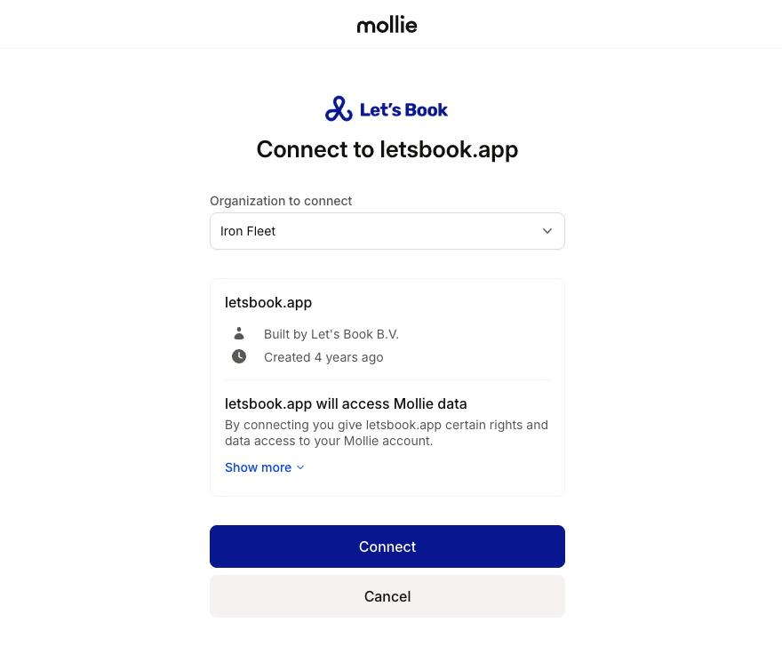

# Set up Mollie integration

Collect online payments with Mollie directly from your Let's Book checkout.

## How to connect Mollie

### 1. Create your Mollie account

If you are new to Mollie, create an account first. It takes a few minutes and unlocks popular payment methods like iDEAL, Bancontact, credit cards, and Apple Pay.

- Sign up on the [Mollie registration page](https://www.mollie.com/signup)
- Confirm your email and complete the basic company details

### 2. Log in to the Mollie dashboard

Access your Mollie settings and profiles.

- Open the [Mollie dashboard](https://my.mollie.com) and sign in to your account
- Keep this tab open while you connect from Let's Book

### 3. Open Let's Book integrations

Connect from your Let's Book dashboard.

- Go to [Integrations](https://dashboard.letsbook.app/integrations/psp)
- Click Connect via Mollie

### 4. Approve the Mollie Connect screen

Authorize Let's Book to manage payments on your behalf using [Mollie Connect](https://docs.mollie.com/docs/connect-overview). This creates a secure connection as described in the Mollie Connect docs.

- Select the correct organization if your Mollie account has more than one
- Pick the right website profile if you use multiple profiles for different brands or sites
- Review the requested permissions and click Connect

:::warning
Select the correct company and profile if you have multiple. This ensures payments and payouts land in the right place.
:::

### 5. Return to Let's Book

Mollie redirects you back to your Let's Book dashboard once the connection succeeds.

- You see Mollie listed under Connected integrations
- New online bookings can now use Mollie checkout

### 6. Complete Mollie onboarding if prompted

Sometimes Mollie needs more information to activate payouts. You can usually accept payments immediately, although payouts only start after you finish onboarding.

- If you see the message "Before you can receive payments, Mollie needs more information," follow the link to complete onboarding
- Provide any requested KYC details and bank account verification

### 7. Choose the right profile

If you manage multiple websites or brands, choose the correct Mollie profile for this Let's Book environment.

- Open Integrations in Let's Book and verify the selected profile matches your live site
- This keeps payment descriptions, webhooks, and statements tidy

### 8. Understand verification and payouts

Mollie may perform extra verification. Payments can succeed while verification is pending. Payouts start after Mollie approves your account.

- Keep taking bookings without interruption
- Expect your first payout once all checks are completed

## Go live

When you are ready to accept real payments, set the integration to Live.

- Go to the [Integrations](https://dashboard.letsbook.app/integrations/psp)
- Select Mollie as the current payment provider and hit Save.
- Your checkout now charges real cards and local methods.

Need a refresher on how Mollie Connect works under the hood? See the [official overview](https://docs.mollie.com/docs/connect-overview)
