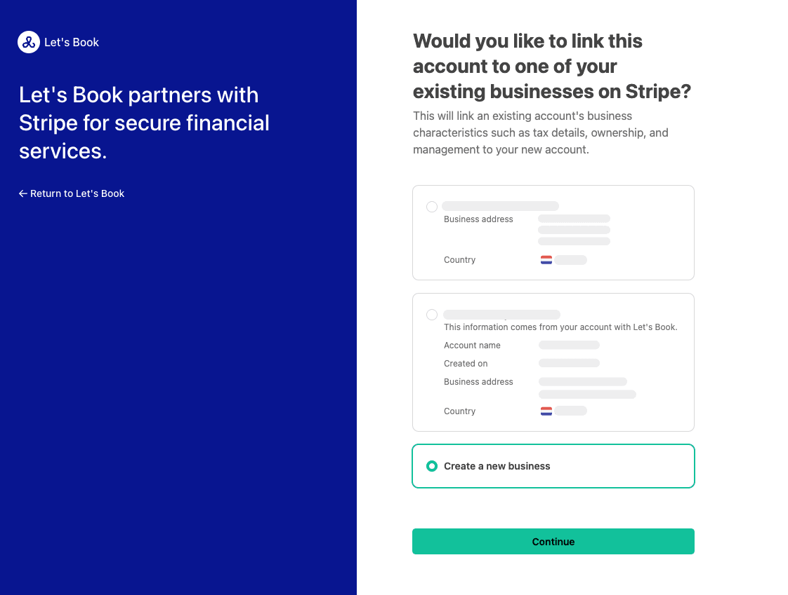

# Set up Stripe integration

Collect online payments in your Let's Book checkout using Stripe Connect.

## Connect Stripe

Open the [Integrations page](https://dashboard.letsbook.app/integrations).

### 1. Create your Stripe account

New to Stripe? Create an account so you can accept cards, Apple Pay, Google Pay, and local methods like iDEAL.

- Sign up on the [Stripe registration page](https://dashboard.stripe.com/register)
- Confirm your email and complete your business profile

### 2. Log in to Stripe

You approve the connection from Stripe.

- Open the [Stripe dashboard](https://dashboard.stripe.com) and sign in
- Keep this tab open

### 3. Connect from Let's Book

- Go to the [Integrations page](https://dashboard.letsbook.app/integrations)
- Click Connect via Stripe

### 4. Approve the Stripe Connect screen

Authorize Let's Book in Stripe. This creates a secure connection using [Stripe Connect](https://docs.stripe.com/connect)

### 5. Return to Let's Book

After approval, Stripe sends you back to your dashboard.

- Stripe appears under Connected integrations
- New online bookings can use Stripe checkout

### 6. Complete onboarding if prompted

To enable live payouts, Stripe may ask for KYC details. You can usually take payments right away. Payouts start after onboarding is finished.

- If you see a verification banner, click it and finish onboarding
- Provide requested company documents and bank details

### 7. Verification and payouts

Payments can succeed while verification is pending. Payouts start once Stripe approves your account.

- Keep taking bookings
- Expect your first payout after checks complete

### 8. Go live

Switch from test to live when you are ready to charge real customers.

- Go to the [Integrations page](https://dashboard.letsbook.app/integrations)
- Select Stripe as the current payment provider and click Save
- Your checkout now charges real cards and supported local methods

## Payment methods in checkout

Your checkout shows payment methods based on three things: your [Stripe settings](https://dashboard.stripe.com/settings/payment_methods), the customer’s context, and your Let's Book configuration.

### Customer context

Stripe tailors options to the customer country, currency, and device.

**Examples**

- Charge EUR for a Dutch customer. Expect iDEAL and cards.
- Charge USD from a US customer. Expect cards and wallets like Apple Pay or Google Pay if available.

:::info[Tip]
If a method you expect is missing, check all three layers: Stripe payment method activation and capabilities, the customer’s country and currency, and the device you are on (Apple Pay only works on Apple devices).
:::

## Learn more

- [Stripe Connect overview](https://docs.stripe.com/connect)
- [Payment methods by country and currency](https://docs.stripe.com/connect/payment-methods)
