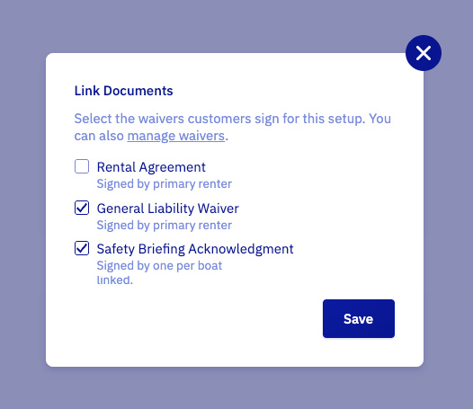

import InlineVideoPlayer from '@site/src/components/InlineVideoPlayer';

import connectingWaiversVideo from '../graphics/connecting_waivers.mp4';

# Set up waivers and contracts

Paperwork without the paper. Collect signed docs with our [WaiverForever](https://www.waiverforever.com/?referral=letsbook) integration. Use it for waivers, rental agreements, and other must-sign moments.

## Connect WaiverForever

1. Create a [WaiverForever](https://www.waiverforever.com/?referral=letsbook) account.
1. Go to [Waiver Templates](https://app.waiverforever.com/templates) and create a template.
1. Start from a gallery template, upload a PDF, or build from scratch.
1. Publish the template.
1. Open [Webhooks & API](https://app.waiverforever.com/settings/api) and generate a New Application Key.
1. Paste that key into WaiverForever API Key in our [Integrations](https://dashboard.letsbook.app/integrations/waivers) page, then submit.

:::note
Use the built-in Name field in your [WaiverForever](https://www.waiverforever.com/?referral=letsbook) template. We extract it and show it on the booking detail page.
:::

## Set up each document

Every WaiverForever template shows up under **Prefill documents** on the [Waivers integration page](https://dashboard.letsbook.app/integrations/waivers). Expand a template card to configure it.

### Document settings

- **Title**: name it your way or add translations.
- **Description**: we prefill it; tweak as needed.
- **Who should sign**:
    - **Primary renter** for contracts where one signature covers the booking.
    - **One per boat** for contracts on multi-boat bookings.
    - **All passengers** for waivers, when you track headcount.
    - **Anyone** for waivers, when headcount is not tracked.

:::info
For "All passengers", set your [boat model](https://dashboard.letsbook.app/models) to ask for passenger count. Otherwise pick "Anyone".
:::

### Prefill fields

Stop asking customers to retype data you already have. Map each WaiverForever field to a Let's Book variable so waivers arrive pre-filled when the customer signs.

<InlineVideoPlayer videoSrc={connectingWaiversVideo} />

Pick a variable from the dropdown next to each field:

- **Customer**: Name, Email, Phone number.
- **Booking**: reference, passengers, boats.
- **Rental**: pickup date, return date, dock name, boat model name.

Choose **Not mapped** for fields you want the customer to fill themselves. Signature and checkbox fields can't be prefilled, ever.

The badge in the card header tracks progress. Green means every mappable field has a variable, yellow means only some do.

:::tip
Give your WaiverForever fields clear titles like "Customer email" or "Pickup date". Vague labels like "Field 3" make mapping a guessing game.
:::

:::note
Customer details always come from the booking's primary renter, even when "Who should sign" is set to a different option.
:::

## Link documents to a dock and boat model

Now decide when renters see each document.

1. Open [Rental setup](https://dashboard.letsbook.app/rental-setup) and pick the dock and boat model.
1. Click **Edit** on the **Documents to sign** card.
1. Check every template you want signed for this combination, then save.

Templates that still need configuration on the Integrations page show up as disabled rows with a "Needs setup" hint.
