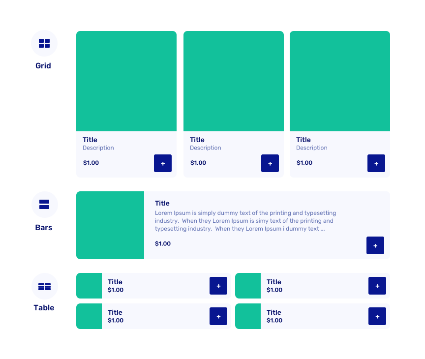

# Create add-ons

Add-ons let customers enhance their trip with extras like drinks, snacks, equipment, or services. Set up add-ons to increase revenue and improve customer experience.

  <a href="https://dashboard.letsbook.app/add-ons/add" class="button button--primary" target="_blank" rel="noopener noreferrer">Create add-ons</a>

## Setting up add-ons

### Basic information

**Name and descriptions:** Use clear names customers will recognize. The short description appears on overview pages, long description on detail pages.

**Categories:** Group similar add-ons (e.g. "Drinks", "Equipment", "Food") to organize your booking form.

**Photos:** Upload square images (JPG or PNG). The first photo shows on overview pages. [Crop photos online](https://www.befunky.com/create/crop-photo/) for best results.

### Pricing and limits

Set price per item with optional quantity limits:

- **Per booking** - Maximum items per entire booking
- **Per boat** - Limit based on boat capacity
- **Per passenger** - Items per person
- **Per passenger per hour** - Useful for consumables (e.g. 2 beers per person per hour)

### Availability conditions

Control when add-ons are available by setting conditions:

- **Between times** - Limit to specific hours (e.g. breakfast 8-10am)
- **Between dates** - Only offer seasonal items during certain periods
- **Only at dock using boat model** - Restrict to specific location and boat combinations
- **Days of the week** - Weekend-only specials or weekday offers
- **Trip duration** - Require minimum rental length for premium add-ons
- **Minimum time upfront** - Set lead time for items needing preparation

## Organizing the booking form

  <a href="https://dashboard.letsbook.app/add-ons/categories" class="button button--primary" target="_blank" rel="noopener noreferrer">Manage categories</a>

**Layout options per category:**

- **Grid** - Large square photos with prices
- **Bars** - Medium-sized photos with descriptive text
- **Table** - Compact view for smaller display

**Category ordering:** Arrange categories to guide customers (essentials first, luxury items last).

## Stock management

Mark add-ons as "Out of stock" when they're temporarily unavailable.

---

_Add-ons typically increase average booking value by 20-40%. Start with a few popular items and expand based on customer feedback._
