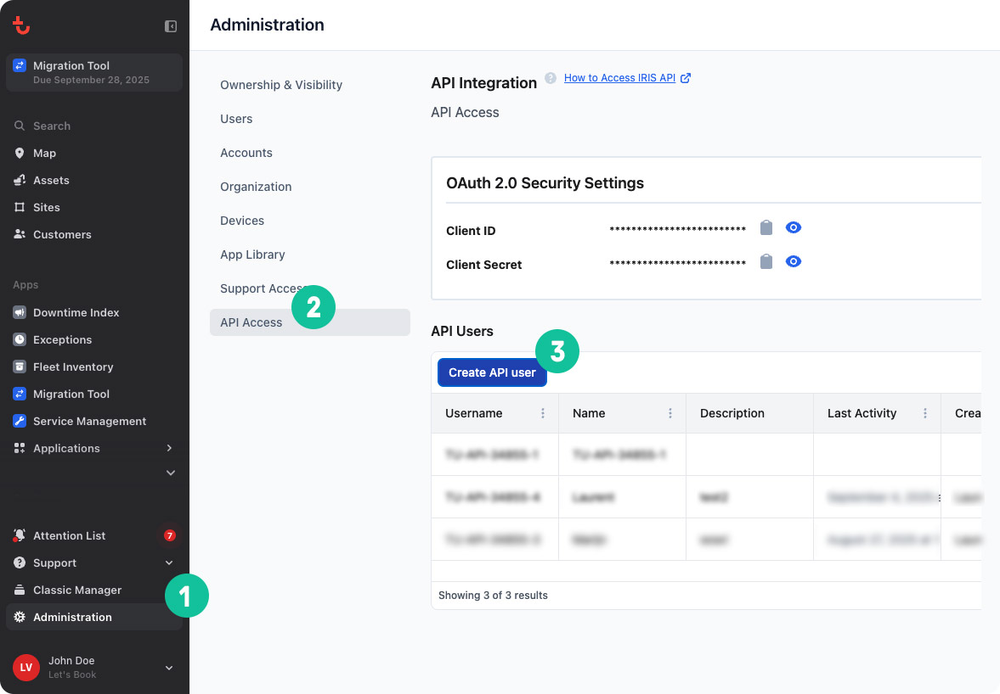
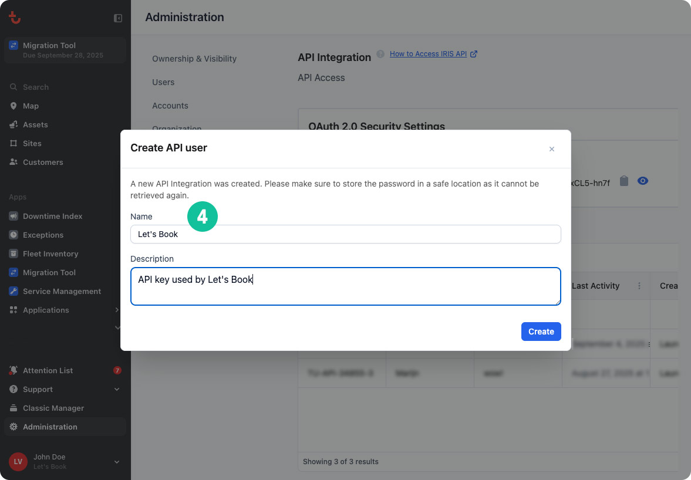

# Connect boats

Create a hardware connection between your boats and Let's Book software, allowing customers to start boats themselves with their smartphone and giving you complete remote control over your fleet.

## What is connected fleet?

Connected fleet creates a seamless link between your bookings and physical boats. Customers receive an SMS with their booking details, select their boat, and start the engine directly from their phone. Meanwhile, you get real-time monitoring, GPS tracking, and remote control capabilities.

**Customer experience:**

- SMS notification with booking link before departure
- Select available boat from their booking page
- Start and stop the boat engine with one click
- Automatic trip timeline registration

**Your benefits:**

- Perfect overview of fleet status and trip progress
- Remote boat control for quick assistance
- Accurate rental duration tracking
- Less staff required for check-in/check-out
- Real-time location monitoring and battery voltage tracking

## Hardware partners

**Trackunit:** Advanced fleet monitoring with GPS tracking, engine hours, battery voltage, and maintenance alerts. Perfect for professional operations needing comprehensive data.

**Qondor:** Real-time fleet monitoring with route history and geofencing alerts. Ideal for ensuring boats stay within designated areas.

**SMS-Relay:** Basic remote start/stop functionality via SMS commands. Simple solution for essential remote control.

## Connecting boats to software

### Trackunit integration

**Prerequisites:** Trackunit hardware installed and active Trackunit account

**Steps:**

1. Go to [Integrations](https://dashboard.letsbook.app/integrations) in Let's Book
2. Find Trackunit and click "Connect" (keep modal open)
3. In separate tab, go to [Trackunit Administration](https://new.manager.trackunit.com/administration)
4. Select "API Access" → "Create API user"
5. Enter name ("Let's Book") and description ("API key for Let's Book")
6. Copy the four generated values: Client ID, Client Secret, Username, Password
7. Paste all values into Let's Book modal and click "Save"

Steps:

### Qondor integration

**Prerequisites:** Qondor hardware installed in boats

**Steps:**

1. Find tracker ID in your Qondor dashboard or on the physical tracker
2. Go to [your boat models](https://dashboard.letsbook.app/models)
3. Select the boat model and click on specific boat
4. In "Connect boat" section, select "Qondor"
5. Paste tracker serial number and save

### SMS-Relay connection

**Prerequisites:** SMS-relay hardware installed

**Steps:**

1. Go to [your boat models](https://dashboard.letsbook.app/models)
2. Select boat model and click on specific boat
3. In "Connect boat" section, select "SMS-Relay"
4. Enter the SMS relay number and save

## After connection

Once hardware is connected, continue with [setting up your connected fleet](https://support.letsbook.app/article/140-get-started-with-connected-fleet) to configure customer permissions, rental rules, and operational settings.
