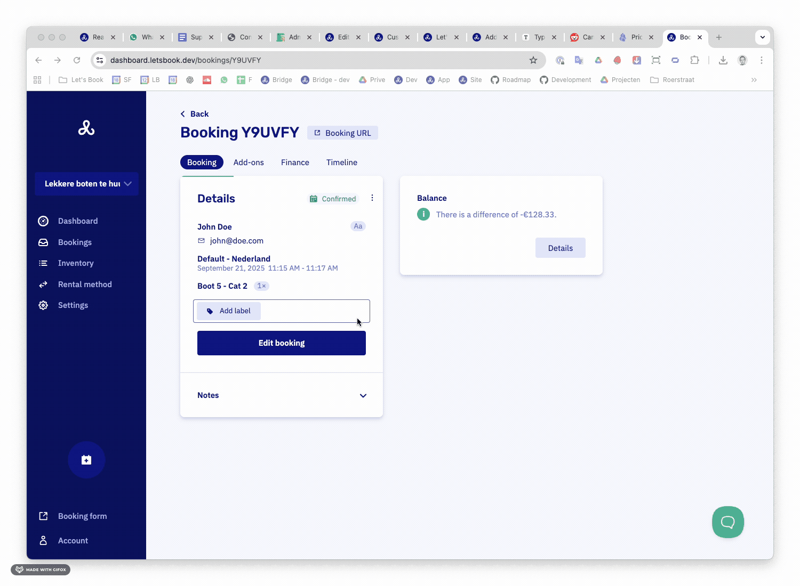

## Edit a booking

1. Open the booking
2. Click **Edit booking** and make adjustments
3. Save

:::note[Watch out for pricing changes]
When you edit a booking, the price might change. Keep this in mind and send a new payment request, register a cash payment, or charge the credit card again if needed.
:::

:::note[Add-ons heads up]
You won't get a notification when changing add-ons, so don't forget to inform others if needed.
:::
## Cancel a booking

1. Open the booking
2. Click the three dots (top right of the first card)
3. Select **Cancel booking**
4. Add your reason
5. Confirm

Done. The booking is cancelled and your customer gets notified.

