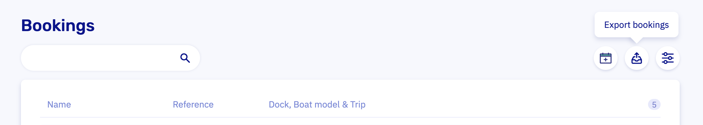

# Export bookings

Head to the [Bookings overview](https://dashboard.letsbook.app/bookings) and export everything to an Excel file with a couple of clicks. Exports are handy for reporting, number‑crunching, or sending data to a third‑party system that insists on living in its own little universe. When you’re ready, click the export button in the top right to kick things off.

## Filtering

By default, the date range shows only future bookings (from now onward). To include completed trips, adjust the date range to the relevant period and select the “completed” booking status.

Need a specific subset of bookings? You can filter by date range, dock(s), boat model(s), booking status, and more.

## Export limits

Exports are capped at 1,000 bookings per file. If you’ve got more than that (nice job!), slice the data into multiple exports using filters. Date ranges work especially well.
