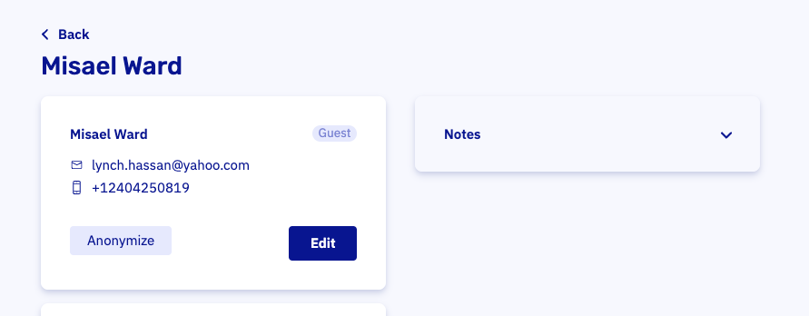

# Anonymize customers

## Why it exists
GDPR (Europe) gives customers the right to be forgotten. When you anonymize a customer, we remove their personal details. The bookings stay, but you can no longer find them by the customer’s name. Use the booking reference or filters instead.

## How to do it
To anonymize a customer, [find the customer](https://dashboard.letsbook.app/customers) and click Anonymize.

Changed your mind? You can edit the customer and re‑enter their details. Note: they won’t be anonymous anymore.

## Anonymizing customers with an account

Customers with an account can also be anonymized. We’ll log them out immediately and they won’t be able to log in again.