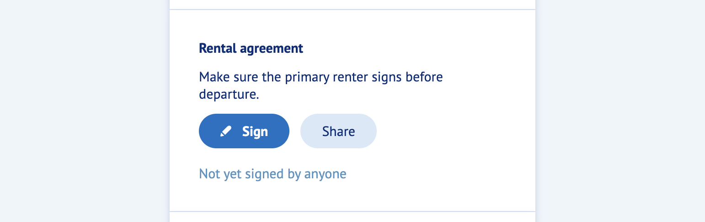
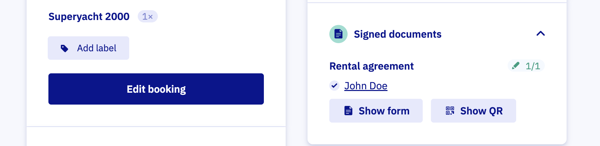

# Work with contracts

Use our waiver integration to collect signatures on your rental agreement and other documents. If you have not set it up yet, start with the [setup guide](../settings/waivers/set-up-waivers.md).

## How it works for customers

- After payment, the renter lands on the booking details page.
- The page shows a clear prompt to sign the contract.

- When the renter clicks "Sign", we open the WaiverForever document.
- After signing, it can take up to one minute for the signed status to appear on the booking page.

## Track signatures in the dashboard

Open any booking from the [Bookings overview](https://dashboard.letsbook.app/bookings) to see who signed the contract.

:::info[Tip]
Use the Document filter on the [Bookings overview](https://dashboard.letsbook.app/bookings) to find all bookings still awaiting signatures.
:::

If the customer arrives without signing, open the form for them with the "Show form" button. Or have them scan the QR code on their own device.

## Remind your customers

Right after booking, renters are excited. A short reminder helps.

- Mention the rental agreement in your booking confirmation email.
- Add a button that links to the booking details page. It always shows the latest signing status.

Once this is in place, waivers are fully integrated into your Let's Book setup.
