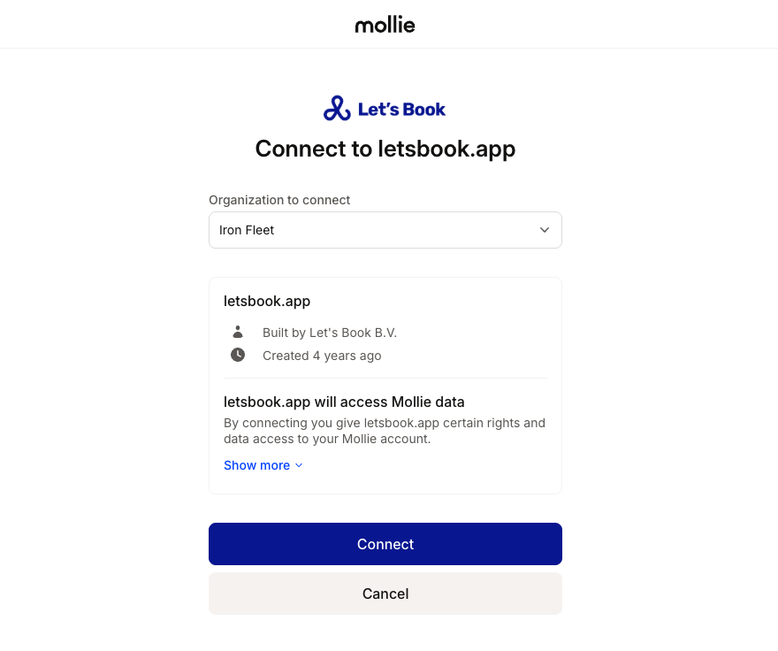

# Set up Mollie integration

We have a great integration with Mollie to make it easy for you to receive payments.

## How to connect Mollie

- create an account if you don't have one already
- Log in to your [Mollie dashboard](https://my.mollie.com/)
- Go to [Integrations](https://dashboard.letsbook.app/integrations) and click **‘Connect via Mollie’**.
- Complete the Mollie flow by entering the details to connect.
  
  :::warning
  Make sure you select the correct company from the dropdown if you have multiple
  :::
- You will automatically be redirected back to the dashboard.
- Sometimes, you'll see a warning like "Before you can receive payments, Mollie needs more information." In that case, continue onboarding
- If you have multiple 'profiles', select the correct one from the dropdown
- Sometimes Mollie needs to verify your details, but you can already receive payments. The payout to your bank account will only happen once you completed all enquiries.

## Go live

Once you’re ready to accept real payments, go to Integrations and choose **Mollie**, click **Save**, and you’re live.