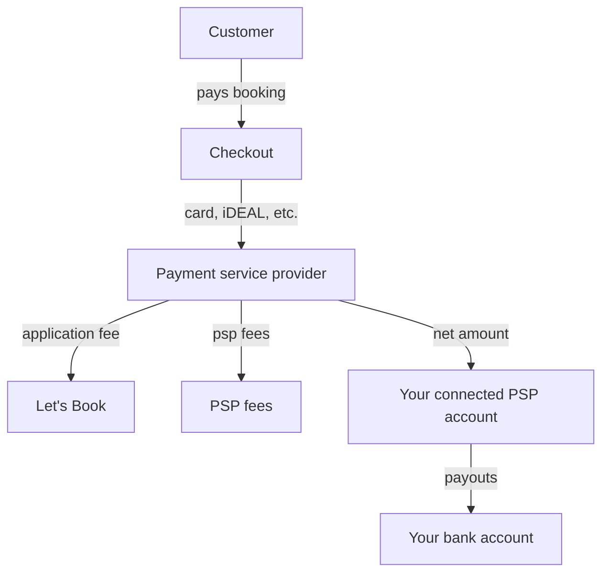

# Receive payments

Get paid directly to your own payout account. Connect one of our supported Payment Service Providers (PSP) in minutes and Let’s Book routes every customer payment to you.

## Connect your payment provider

- Hook up Let's Book to [Stripe](./stripe.md) or [Mollie](./mollie.md).
- Complete the onboarding with your business details and bank account.
- Back in Let’s Book, set the payment provider to Stripe or Mollie and click Save.

## Application fees

We charge an application fee on each successful payment. The provider deducts our fee and their own fees before payout. You receive the net amount in your connected account.

Note: Exact fee amounts and models depend on your Let’s Book plan and contract.

## How payouts work

- Money flows to your connected account at the provider you choose.
- The provider settles to your bank based on your payout schedule.

Payout timing depends on your provider and region. New accounts often have a longer first payout. After that it follows your configured schedule.

Here's a high level diagram to explain how the money paid by the customer reaches your bank account.

## Refunds and disputes

- You can refund from your provider's dashboard by visiting the Finance tab in the Let's Book dashboard and clicking on a payment or deposit.
- For chargebacks or disputes, the provider handles the process and may debit the disputed amount from your next payout.

## Tips

- Search for bookings using the booking reference in your provider dashboard.

Need help? Contact [support](mailto:support@lets-book.com) and we'll help you!
