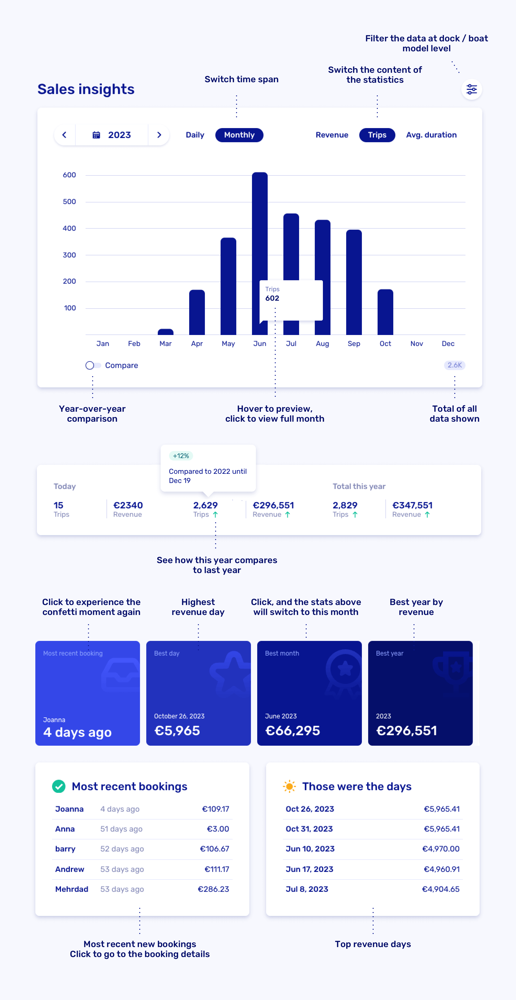

# Sales insights

Turn your season into a scoreboard. The [Sales insights](https://dashboard.letsbook.app/sales) dashboard shows what’s working, what’s not, and what deserves a victory lap.

## Quick tour

Curious about every button, toggle, and gizmo? Start with the infographic below.

## Compare seasons

Compare revenue year over year to see how this season stacks up against previous ones. Great for planning—better for winning.

## Admin-created bookings

If a booking has costs, it counts as revenue. To fine-tune:

- Apply discounts to reduce revenue when needed.
- Use [blockout periods](https://dashboard.letsbook.app/blocks) to keep non-revenue days out of the way.

## Data attribution

Revenue shown always excludes tax. All booking revenue is attributed to the pickup date, even for multi-day rentals.
