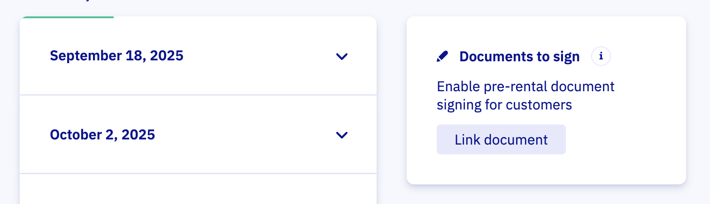

# Set up waivers and contracts

Paperwork without the paper. Collect signed docs with our [WaiverForever](https://www.waiverforever.com/?referral=letsbook) integration. Use it for waivers, rental agreements, and other must-sign moments.

## Connect WaiverForever

1. Create a [WaiverForever](https://www.waiverforever.com/?referral=letsbook) account.
1. Go to [Waiver Templates](https://app.waiverforever.com/templates) and create a template.
1. Start from a gallery template, upload a PDF, or build from scratch.
1. Publish the template.
1. Open [Webhooks & API](https://app.waiverforever.com/settings/api) and generate a New Application Key.
1. Paste that key into WaiverForever API Key in our [Integrations](https://dashboard.letsbook.app/integrations) page, then submit.

:::note
Use the built-in Name field in your [WaiverForever](https://www.waiverforever.com/?referral=letsbook) template. We extract it and show it on the booking detail page.
:::

## Link documents to a dock and boat model

Now decide when renters see the document.

1. Open [Rental Setup](https://dashboard.letsbook.app/rental-setup) and select the dock and boat model.
1. Link the WaiverForever document to that combination.

## Configure how it is used

Pick the document and fine-tune:

- **Title**: say it your way or add translations.
- **Description**: we prefill it to save you time; tweak as needed.
- **Who should sign**: Use "Primary renter" or "For every boat" when working with [contracts](../../day-to-day/work-with-contracts.md) and use "All passengers" or "unlimited" when working with [waivers](../../day-to-day/work-with-waivers.md).

:::info
To collect a signature from every passenger, set your [boat model](https://dashboard.letsbook.app/models) to ask for passenger count. Not tracking headcount? Choose "Unlimited" for the document.
:::

### Next steps:

- Learn how to [work with contracts](../../day-to-day/work-with-contracts.md).
- Learn how to [work with waivers](../../day-to-day/work-with-waivers.md).
