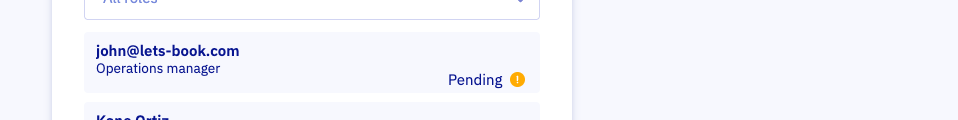
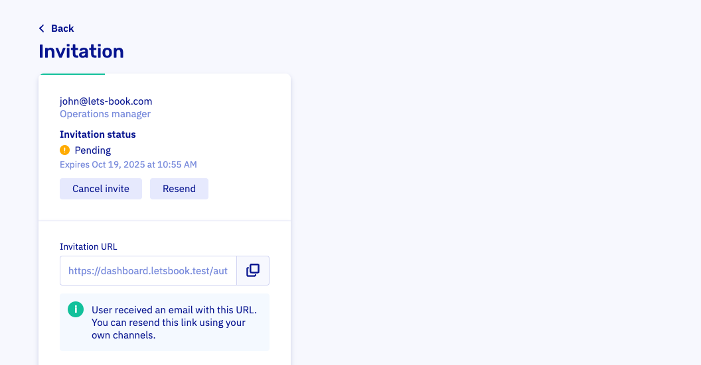

# Invite coworkers

Invite teammates from your [Users](https://dashboard.letsbook.aoo/users) page. Click Add, enter their email, and send.

If you grant access to all docks, they also get access to any docks you add later. Be sure you want that.

:::note
If they already use Let's Book, they accept the invite. If not, they'll create their account during acceptance.
:::

## Track pending invites

While an invite is pending, you'll see a Pending badge next to the user.

Lost email? Resend the invite or copy the invitation link and share it via chat or SMS.

## Cancel an invite

Don't want to wait? Cancel the invite. We won't notify them. If they try the link later, they'll see "Invitation not found."
