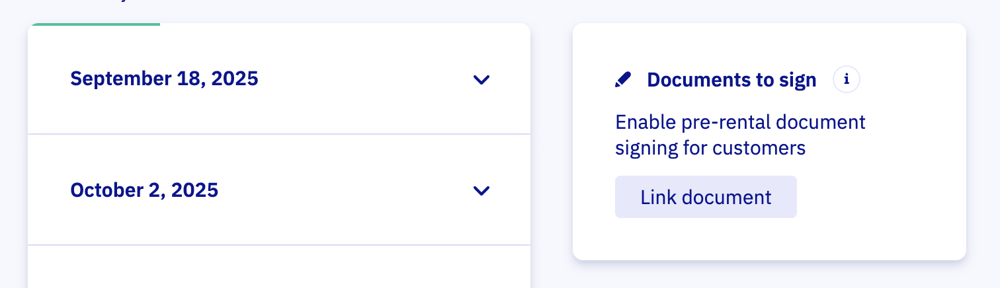

# Set up waivers and contracts

You can ask your customers to sign all kinds of documents. This could be waivers, rental agreements or other types of contracts. With our [WaiverForever](https://www.waiverforever.com/?referral=letsbook) integration, all of this is possible. 

## Getting started

1. First, create an account at [WaiverForever](https://www.waiverforever.com/?referral=letsbook).
1. Head over to [Waiver Templates](https://app.waiverforever.com/templates) and create a new template.
1. Pick one of their default templates from the gallery, upload an existing PDF or create one from scratch.
1. Tweak the template to your liking. Once your template is ready, publish it!
1. With your template published, head over to [Webhooks & API](https://app.waiverforever.com/settings/api) and generate a "New Application Key".
1. Copy the newly created key, paste it under WaiverForever API Key on our [Integrations](https://dashboard.letsbook.app/integrations) page and submit the form.

:::note
When asking for the customer's name in your template, make sure to use the provided 'Name' field. We extract this information and display it on the booking detail page
:::

## Linking a document to a dock and boat model

Great job on getting the integration set up. Now we'll configure when the document is displayed to your customers. 

1. Navigate to the [Rental Setup](https://dashboard.letsbook.app/rental-setup) page and pick the relevant dock / boat model combination.
1. Now you should be able to link specific documents to this combination.

## Configuring how it is used

Select the relevant document from the list. You can change the title if you want to display a different title to your customers or translate it to different languages.

The description is automatically prefilled, but you can change it to your liking. 

## Delays

It can take up to a minute 

1 minuutje

Who should sign determines how it is displayed

Step 5: Inform Customers in Booking Confirmation
To ensure customers know they need to sign a waiver, edit your booking confirmation message.

Go to the Notifications page.
Add a note in the booking confirmation email explaining that waivers must be signed and can be accessed on the booking detail page.
By completing this step, waivers will be fully integrated into your Let's Book system, ensuring all necessary legal documents are properly managed.