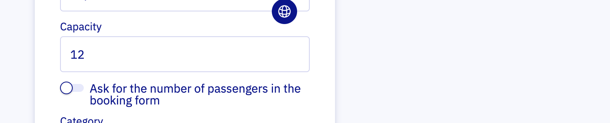
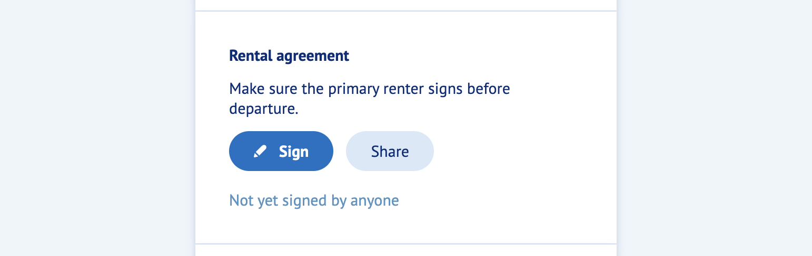
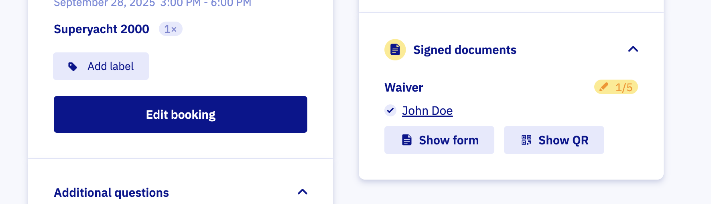

# Work with waivers

Get every passenger to sign before they step aboard. If you have not set it up yet, start with the [setup guide](./set-up-waivers.md).

## Set it up

To collect a signature from every passenger, set your [boat model](https://dashboard.letsbook.app/models) to ask for passenger count. Not tracking headcount? Choose "Unlimited" for the document.

## What customers see

- After paying, the renter lands on the booking details page.
- The page asks them to sign the waiver and share it with fellow passengers.
- Passengers get a direct link to the waiver.

- When the renter clicks "Sign", the WaiverForever document opens.
- After signing, the booking page can take up to one minute to show the updated status.

## Track signatures in the dashboard

Open any booking from the [Bookings overview](https://dashboard.letsbook.app/bookings) to see who has signed. For Unlimited, there is no progress indicator.

:::info[Tip]
Use the Document filter on the [Bookings overview](https://dashboard.letsbook.app/bookings) to find bookings still awaiting signatures. This filter does not apply to Unlimited.
:::

If a customer arrives without signing, open the form with the "Show form" button or let them scan the QR code on their own device.

## Remind your customers

Right after booking, renters are excited. A short reminder helps.

- Mention the waiver in your booking confirmation email.
- Add a button that links to the booking details page. It always shows the latest status.

Once this is in place, waivers are fully integrated into your Let's Book setup.
