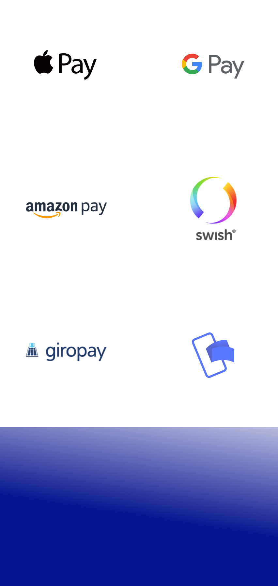

# v1.5 - Stripe users can now choose their own payment methods

We've upgraded our Stripe integration, giving you even more flexibility in how you accept payments. You can now choose exactly which payment methods you want to offer your customers:

- **Apple Pay & Google Pay** – Fast and secure mobile payments.
- **Swish** – Popular in Sweden for instant bank transfers.
- **iDEAL, Blik, Link, Bancontact, Giropay, Przelewy24 & More** – Regional favorites across Europe.
- **Revolut Pay & Amazon Pay** – Modern alternatives with global reach.

By selecting only the methods that suit your audience, you streamline the checkout process and increase conversion rates.

## Other Updates

- If a chosen day is booked, we'll suggest the best alternative dates by checking 3 days back and up to 10 days ahead based on your schedule.
- We've added a new hardware integration with Santos Boats, allowing you to directly connect their boats to Let's Book.
