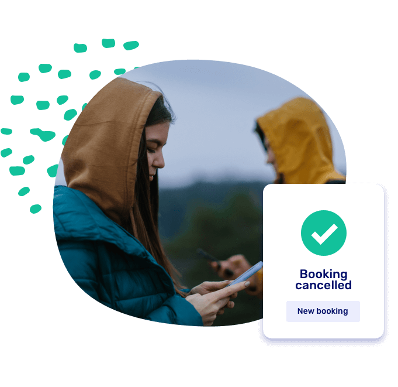

# Sales dashboard and analytics

We're thrilled to announce the arrival of our brand-new Sales Dashboard, crafted with your rental business success in mind. Now, gain a comprehensive overview of your rental performance at a glance. Filter effortlessly by revenue, trips, or average duration, and dissect statistics by location or boat type for deeper insights.

But that's not all – prepare for a touch of delight with our fun features! Experience the joy of confetti as the most recent booking lights up your screen. Dive into your best day, month, and year with ease, uncovering valuable insights along the way.

## New Features

- Introduced a [sales insights page](https://dashboard.letsbook.app/sales)
- Included a pre-arrival email feature
- Enhanced the booking confirmation email for admins
- Enabled exporting all [coupons](https://dashboard.letsbook.app/coupons) to Excel

## Bugfixes

- Corrected the order of docks in the booking form
- Resolved styling problems
- Stopped certain fields from being escaped incorrectly
- Maintained the order of add-ons when edited
- Bugfix with fixed down payment amounts
- Hide docks in booking form when you don't have access
- Allow canceling completed bookings
- Updated default email texts

## Trip timelines

At Let's Book, we've made it possible for you to link a boat to a booking and track the booking's progress with color-coded indicators: green for smooth sailing, yellow for setting sail soon, and red for "oops, they're running late!"

By doing this you get a comprehensive overview of which boats are docked or out making waves.

## Allow customers to cancel their own bookings

Here it is: the option for customers to cancel their trip themselves. But of course, not just anyone can do it: as the rental owner, you determine which customer types are allowed to cancel (for example, only your members), and under what conditions.

Go to [customer types](https://dashboard.letsbook.app/customer-types), select the role you want to edit, and find the section called 'cancellation settings'. You can also add a specific message before cancellation.
