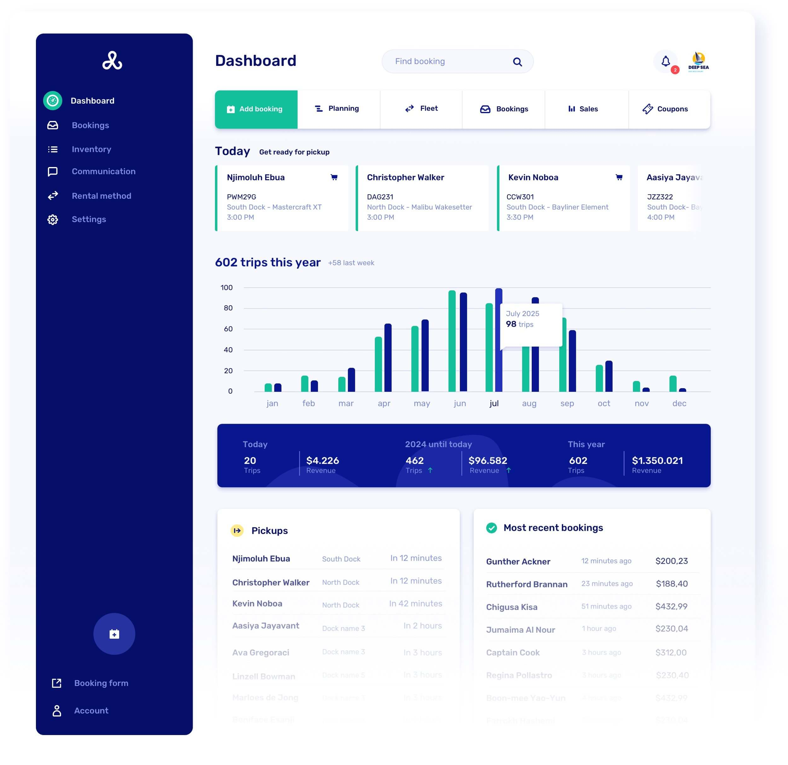

# v0.16 - Dashboard and landing page improvements

Our latest update includes improvements to the landing page and dashboard, offering a clearer view of upcoming and recent bookings. You'll also find useful data on trip frequency per year and month, along with a handy search function to quickly find what you need.

## Overview

- Added new super fancy dashboard
- Added new feature 'payment status' to bookings. You can now filter unpaid or partially paid bookings in your booking overview.
- Added new 'book again' reminder email that is sent after 50 weeks. Setup via communication flows
- It's now possible to rearrange your slots
- Made payment description consistent for Stripe & Mollie
- Improved back button throughout the app
- Filter docks when customer type only has access to one
- Prevented auto selecting dock / boat models when forceLogin is passed, but the customer is not logged in
- Remove slots or schedule
- Fixed bug where new docks were sometimes hidden by default
- Fixed bug where customers could not log in sometimes
