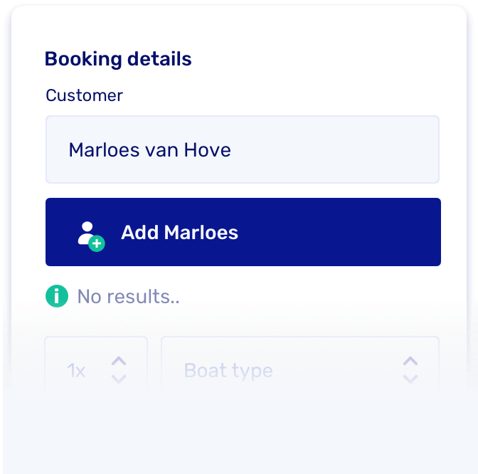
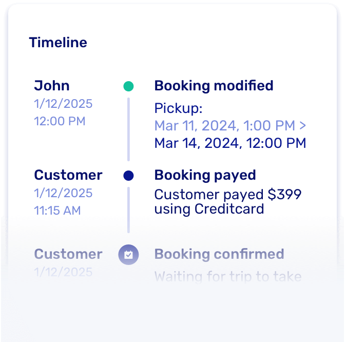

# v0.17 - Major system update for enhanced stability

We've conducted a major update, ensuring that all the technology powering Let's Book is up to date. This has resulted in increased stability and top-notch security.

## Add customer

It's now possible to add a customer while you, as an admin, make a booking.

## Booking timeline

At the booking detail level, there's now a timeline where you can see all the activity related to a booking. This allows you to track who made which changes and when.

## Overview

- Laravel upgrade to 10.x, PHP to 8.3 and to React to 18
- New feature: Register customer from booking form in dashboard
- New feature: Changelog timeline per booking
- Fixed many small bugs
