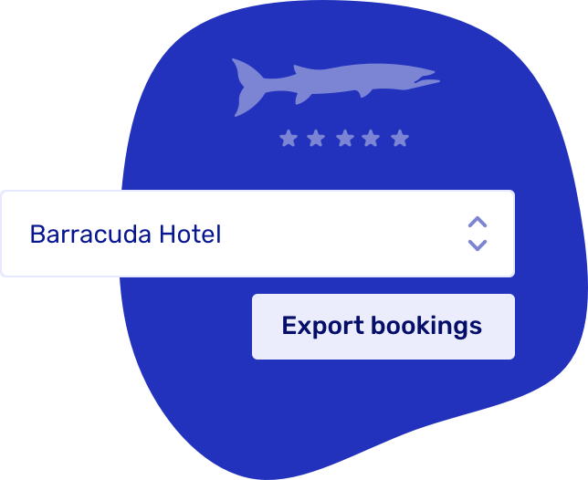

# Latest improvements and feature enhancements

## Partner with resellers and agents

Work with resellers such as hotel concierges or tourist information points to sell trips, by booking directly into your system. Cut out back and forth phone calls to confirm bookings.

### How it works

Create a custom URL for your partners/resellers via [widgets](https://dashboard.letsbook.app/widgets).

Share this unique URL with your partner and provide embedding instructions.

Optionally set a custom price for this partner. When setting a price, under "conditions," select "booked via partner" and then proceed with the desired settings.

Easily track bookings within your Let's Book dashboard using the unique partner identifier assigned to each URL.

Filter bookings by specific partners in the booking overview, export them to Excel for analysis, and view partner details for each booking on the booking detail level.

### Collaboration with Qondor

Let's Book now collaborates with [Qondor](https://www.qondor.co/water-sports), a French hardware and software provider, offering sleek and affordable integration solutions for boats. With a simple connection, you can now link your bookings directly to your fleet, enabling remote on/off toggling and real-time location tracking. Learn [how to implement](/guides/settings/boats/connect-boats) it for your day-to-day use.

### Overview

- Implemented a condition that allows you to hide/show add-ons based on trip lengths. This simplifies tasks like assigning a captain to a trip and accurately pricing it. When [adding an add-on](https://dashboard.letsbook.app/add-ons/add), search for the condition 'trip duration'.
- When sending payment requests, we autofill client phone numbers and email addresses. A much-requested improvement.
- We've added a bell to the dashboard to notify you of major updates
- Added tracking for bookings made through partner websites
- Added support for Qondor tracker, added center ID validation and set instruction interval to 10 seconds
- Updated the plan section
- Fixed a couple of small bugs

