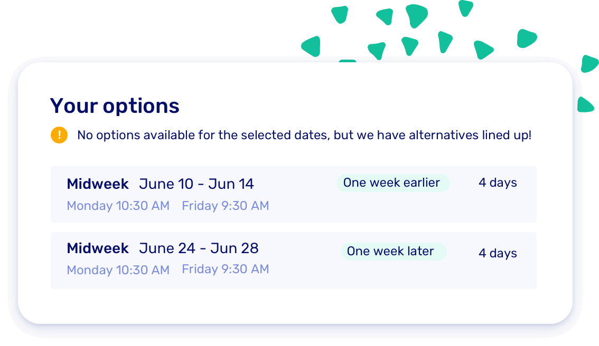

# v1.0 - Multi-day rentals

Long awaited, it's finally here: you can now offer multi-day excursions! Set the duration of the trips and let your customers easily book them in the booking form.

If the schedule fills up, it automatically suggests suitable alternatives, ensuring optimal scheduling.

In addition, you can now view the schedule on a weekly or monthly basis, providing a better overview of longer trips.

Furthermore, the date pickers have been updated everywhere, allowing for multi-day selections. We've also added new shortcuts for quick jumps to 'today', 'tomorrow', or 'this month'. Convenient, right?

Learn how to setup multi-day slots in our support center

[Learn more](https://support.letsbook.app/article/131-schedules-setup-slot-schedule)

## Overview

Multiple day feature

- [Add multi-day slots](https://dashboard.letsbook.app/schedules/slot/add)
- See planning overview in day/week/month views
- Previous slot schedules can now overlap the next one. Read more about the [transition period](https://support.letsbook.app/article/112-about-rental-settings#Transition-Period-M00rN).
- Made booking form a bit smarter: filters docks and boat types by selected dates
- We show alternative slots if you are fully booked
- Improved date picker in bookings overview

## Smart single and multi-day interface

You can now [choose](https://dashboard.letsbook.app/booking-form) the date picker that best fits your type of boat rental.

- **Smart:** Let the system automatically decide between the single or multi-day interface.
- **Primarily single day:** Select this if most of your rentals are for the same day.
- **Primarily multi day:** Choose this if you focus on multi-day rentals. This way, customers are always nudged in the right direction while booking.
- Another small improvement: if you have many slots, we'll automatically ask for your preferred duration first. Then, we'll show the filtered options.

## Other updates

- We enhanced the booking validation and significantly boosted performance.
- Introduced a brand-new design for the [booking form settings](https://dashboard.letsbook.app/booking-form) page.
- Added single date options when selecting multi-day ranges on the weekly schedule.
- New pricing variable for calculating rates based on the number of nights, useful for charging extra for overnight stays.
- Enhanced mobile experience for the date picker.
- Improved dashboard functionality: going 'back' now reloads the previous page.
- And a lot of bug fixes and small improvements