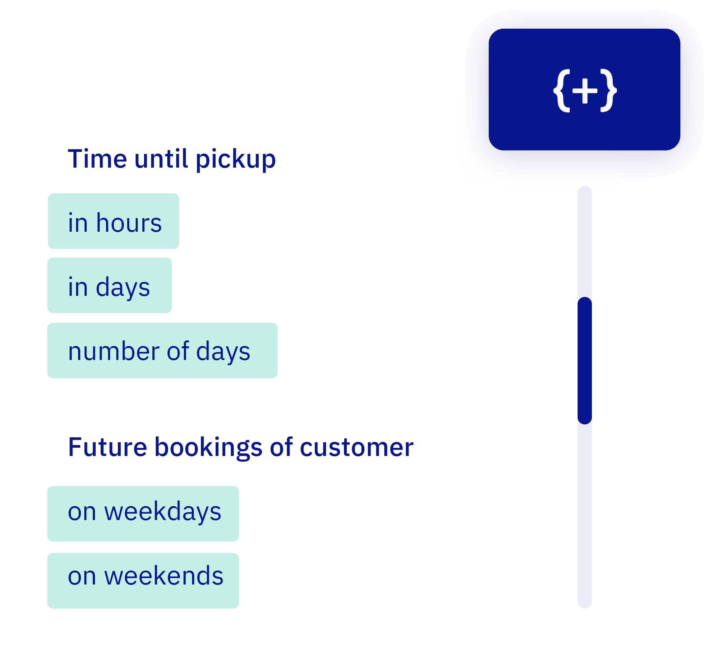

# Advanced conditions per customer type

We already supported standard rules—but now you can handle almost every edge case. Set precise conditions per customer group: how far in advance they can book, on which days, with how many people, and more.

Even the most specific scenarios are now possible using AND/OR logic. Everything runs automatically in the background. Got a fun edge case in mind? We're happy to help.

## Other small updates

- Even more system e-mails are now translated
- Switching boats? Default settings are now a bit more forgiving
- Deposits were charging too early — now they wait their turn.
- Mollie withdrawals and Stripe metering — all up to spec now.
- Fixed lots of bugs and made small improvements throughout the system

Want to fine-tune who can book what and when? Configure rules per [customer type](https://dashboard.letsbook.app/customer-types).
