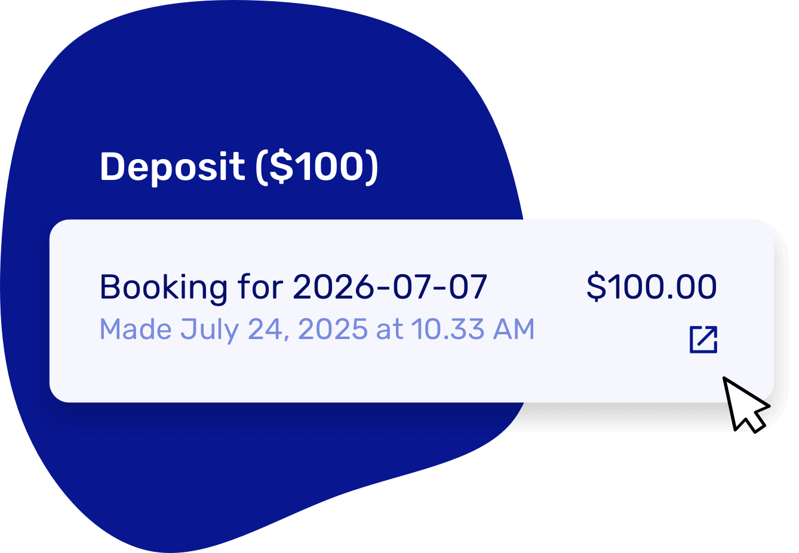

# Faster access to deposits & payments

From the booking page (or via the finance tab), you can now click straight through to the deposit or payment post in Stripe or Mollie. Configure providers via [Integrations](https://dashboard.letsbook.app/integrations).

Super handy for refunds or quick checks. A full integration is coming, but this already saves time.

## Other smaller updates

- Small tweaks on the order overview
- Improved connection with Trackunit
