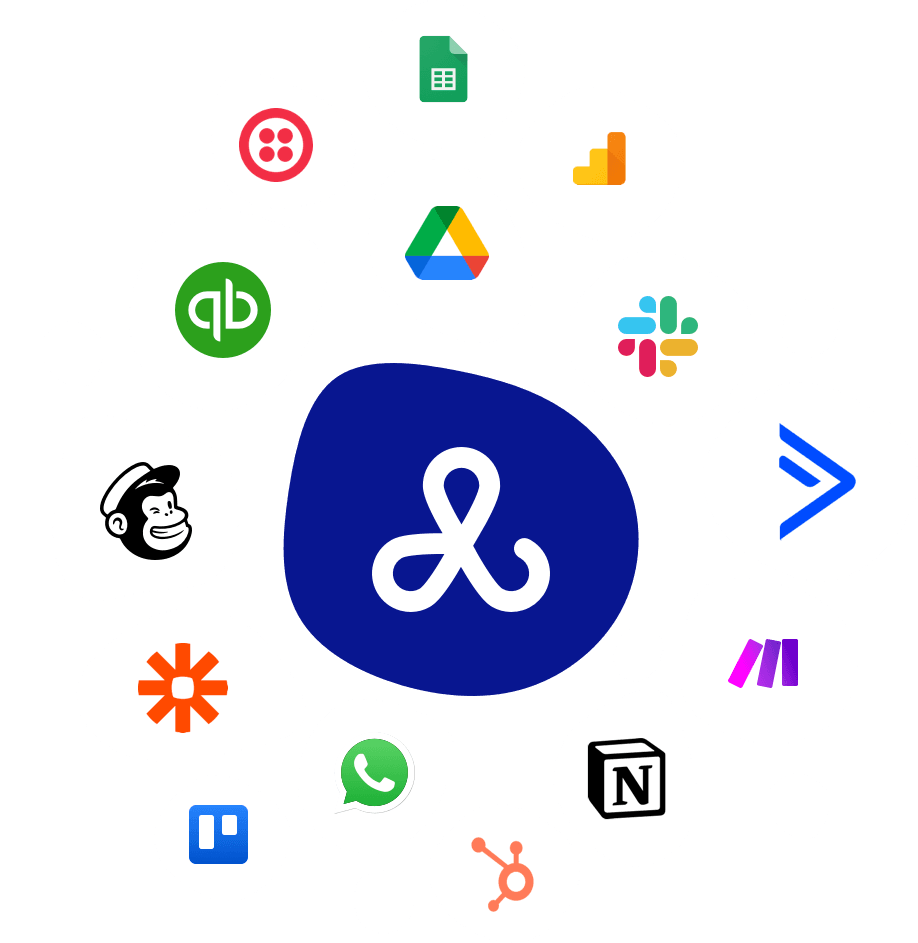

import Button from '@site/src/components/Button/Button';

# Webhooks: Connect Let's Book to all your other software

Get instant notifications when things happen in Let's Book. New booking? Payment succeeded? Customer signed up? Send that data anywhere you want—your CRM, accounting software, Slack, or custom tools.

Set a URL, pick your events, and you're done. Real-time updates, automatically. Perfect for building AI-powered workflows that respond to your business in real-time.

## What you can do

- **Sync everything** - Send booking data to Airtable, Google Sheets, or your dashboard
- **Automate accounting** - Create invoices in QuickBooks or Xero automatically
- **Keep teams updated** - Push notifications to Slack when bookings come in or boats run late
- **Build AI workflows** - Chain actions with [Zapier](https://zapier.com), [Make](https://make.com), or [n8n](https://n8n.io) to trigger AI agents and automations
- **Connect your own tools** - Works with anything that receives HTTP requests

Check the [API documentation](/api/#tag/Webhooks) for technical details and payload examples.

<Button href="/guides/settings/dive-deeper/webhooks">
    Setup guide & examples →
</Button>

### Other updates

- Added queue system for background processes—actions complete instantly while processing happens behind the scenes
- Webhook delivery now uses retry queues—if your endpoint is temporarily down, we'll automatically retry sending the webhook
