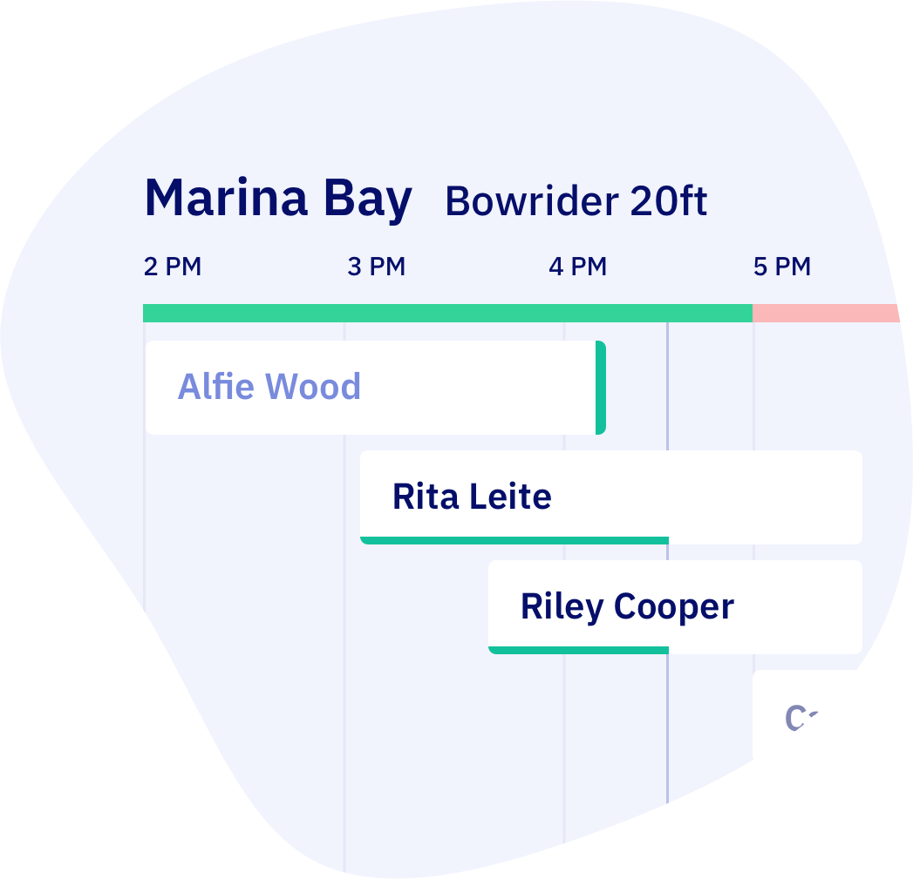

import Button from '@site/src/components/Button/Button';

# Your planning view knows everything now

Your planning overview just got way faster and cleaner. See boat availability directly in the timeline, spot open slots instantly, and filter exactly what you need to see.

## What's new

**Planning and availability merged** - Availability bars now sit directly in your [planning timeline](https://dashboard.letsbook.app/planning), showing you capacity and bookings side by side. See exactly why you're fully booked and when slots open up. Green bars mean boats available, red means fully booked.

**Margins visible in timeline** - See prep time before trips and buffer time after. Spot exactly when late returns will cause problems for your next booking.

**Block bookings visible in timeline** - Maintenance blocks, private events, and downtime now appear directly in your planning view. No more accidentally scheduling over blocked periods.

**Smarter filtering** - Filter by dock location and boat type with one click. Switch between locations instantly to see what's available where. Your selections stick while you work.

**Labels on hover** - Hover any booking to see labels like "VIP", "Late pickup", or custom tags you've added. Quick context without opening the booking.

**Save your favorite views** - Set up your filters once, save the view, and load it anytime. Perfect if you always check the same dock or boat type first thing in the morning.

**Cleaner, faster** - Rebuilt the whole timeline engine. Scrolls smoother, loads faster, handles hundreds of bookings without breaking a sweat.

<Button href="https://support.letsbook.app/guides/day-to-day/planning-overview/">
    Learn how to use it →
</Button>

## Coupon codes overhauled

Search through all your codes, archive old ones, and update usage limits. No more "only showing 3 codes" nonsense.

**What's fixed:**

- Search across all your coupon codes
- Archive codes you're not using anymore
- Update max usages on existing codes
- Reuse archived codes when creating new ones with the same code name
- View more than just the last 3 codes

Basically: coupon management that actually works now.

### Other updates

- Slot names now show up in booking confirmations
- Override mode bookings don't guess costs anymore—what you set is what you get
- Various API improvements under the hood
