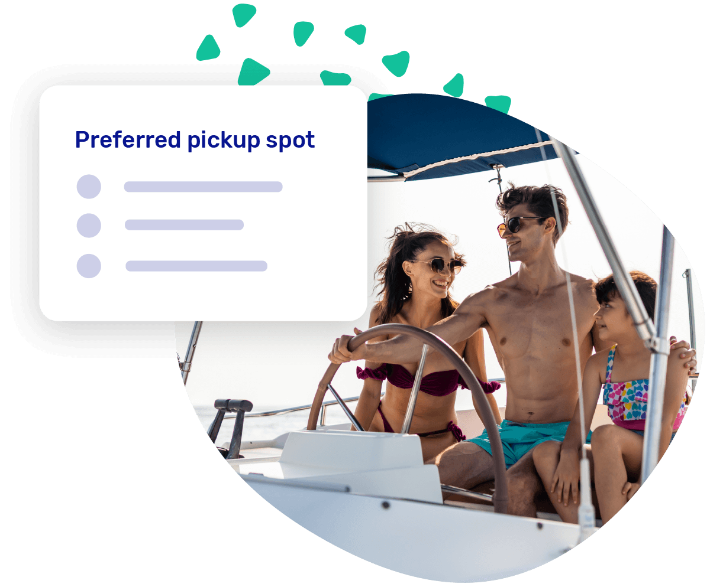

import Button from '@site/src/components/Button/Button';

# The booking form and emails just leveled up

## More powerful booking questions

Additional questions on your booking form just got a big upgrade. Instead of only text fields, you can now add checkboxes, radio buttons, and dropdown menus. Great for things like "How did you hear about us?", required agreements, or choosing a preferred pickup location.
<Button href="https://dashboard.letsbook.app/booking-form/additional-questions">
    Set up your questions
</Button>

## Your emails, your voice

System emails like booking confirmations, reminders, and welcome messages used to be the same for everyone. Not anymore. You can now fully customize the content of every system notification, and use customer variables like name and booking details to make each email feel personal. Match the tone to your brand, add your own instructions, or include specifics about your location.

<Button href="https://dashboard.letsbook.app/notifications">
    Customize your emails
</Button>

## A cleaner payment overview

Small thing, big difference: additional charges of $0 no longer have to clutter up the payment overview. Toggle "Do not display the cost if it amounts to exactly 0" on any additional charge, and your customers only see what actually matters.

<Button href="https://support.letsbook.app/guides/settings/rental-setups/pricing/flexible-pricing#additional-charges">
    Set up additional charges
</Button>

## Book on behalf of a partner

When creating a booking as an admin, you can now assign a partner to it. The booking automatically applies that partner's pricing, add-ons, and other settings — as if it came in through them. Useful when a partner sends you a booking request directly, and you want to make sure the right rates and conditions apply.

<Button href="https://dashboard.letsbook.app/bookings/add">
    Add booking
</Button>

## Other updates

- Pending bookings can now be cancelled immediately with the "Cancel" button, freeing up availability right away instead of waiting for the hold to expire
- Boat models that a customer type isn't allowed to book are now hidden in the booking form
- You can now set up a 24-hour reminder email for upcoming trips via your [notifications settings](https://dashboard.letsbook.app/notifications)
- Several dropdown menus are now alphabetically sorted and grouped with category headers for easier navigation
- The planning timeline now scrolls to the start of the day and shows a daily total of bookings and trips
- Booking confirmation emails now prompt customers to add the trip to their personal calendar (depending on their device)

## Bugfixes

- Fixed an issue where prices were shown in the booking form before making a selection
- Resolved a crash that could occur when saving pricing after removing an add-on product
- Fixed incorrect text appearing when adding labels to a booking
- Various performance and stability improvements throughout the booking form
