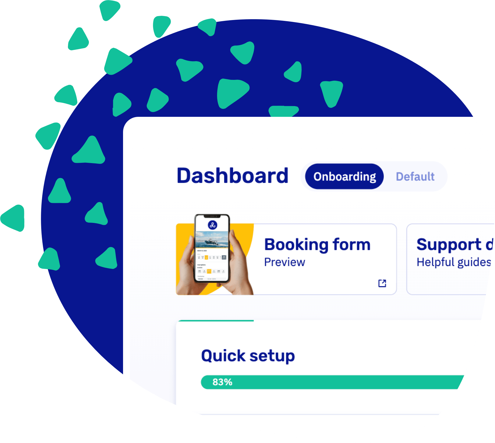

import Button from '@site/src/components/Button/Button';

# Your first day on Let's Book just got a lot easier

Setting up a new rental business used to mean staring at a long list of empty pages wondering where to start. No more. The new onboarding dashboard walks you through every step, so you can have a working setup in minutes instead of days.

## What's new

**Demo mode for a safe first look** - New accounts start in demo mode so you can click around, make test bookings, and see how everything fits together before going live. Clear banners in the dashboard and booking form make sure nobody confuses a demo account with the real thing.

**A dedicated onboarding view** - Instead of hunting through settings, everything you need to get started is grouped in one place with clear next steps. You always know what's done and what's up next.

**Context where you need it** - The onboarding dashboard isn't just a checklist — it's full of helpful context along the way. Right next to the settings you'll find short reads like the ["10 step setup guide"](https://support.letsbook.app/guides/settings/ten-step-setup-guide/) and ["tips before going live"](https://support.letsbook.app/guides/settings/tips-before-going-live/), plus the more advanced fine-tuning and supercharge options that even experienced tenants sometimes miss — so if you've been running your business on Let's Book for a while, it's worth a browse too.

<Button href="https://dashboard.letsbook.app/?showOnboardingDashboard=1">
    Open the onboarding dashboard →
</Button>
