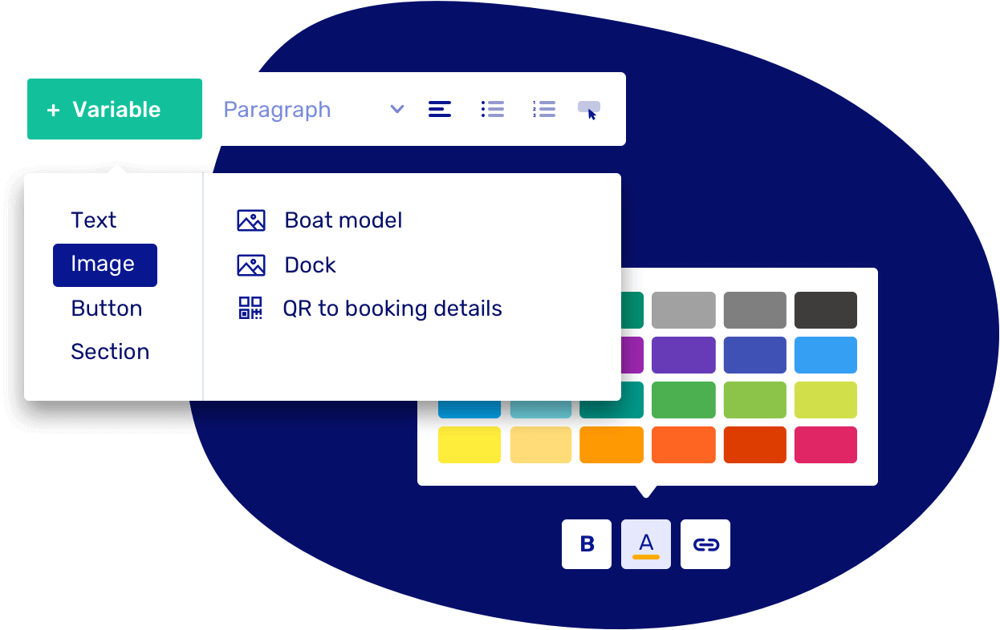

# v1.2 - Language packs

Got customers from around the world? Let's Book has you covered! Your platform now speaks multiple languages, so you can easily switch the language of your dashboard and offer a booking form in your guests' preferred language. Make your customers feel at home, wherever they're from.

## How to use

**Pick languages of my booking form**

Go to text & languages to add your preferred languages.

Next, visit the notifications section to customize and fine-tune the emails you send out.

**Change my dashboard language**

Go to your [profile page](https://dashboard.letsbook.app/account/profile) and select 'Language dashboard' from the dropdown.

## New text editor

We've created a new text editor to make managing your emails simpler and more efficient.

- Edit emails in the languages you've set up for your rental business.
- Add variables yourself—it's not just text anymore! Make your emails more dynamic by including images, buttons, and even full content blocks.
- Customize the design to perfectly match your branding.

All default notifications have been updated and translated, giving you the perfect starting point to tailor them to your needs.

## Other smaller updates

- Customize the font color of the messages you send to your customers.
- We added a language switch in the booking form. You can also hide it via your [booking form settings](https://dashboard.letsbook.app/booking-form).
- Various styling improvements.
- We caught more bugs than a summer night around the campfire!
