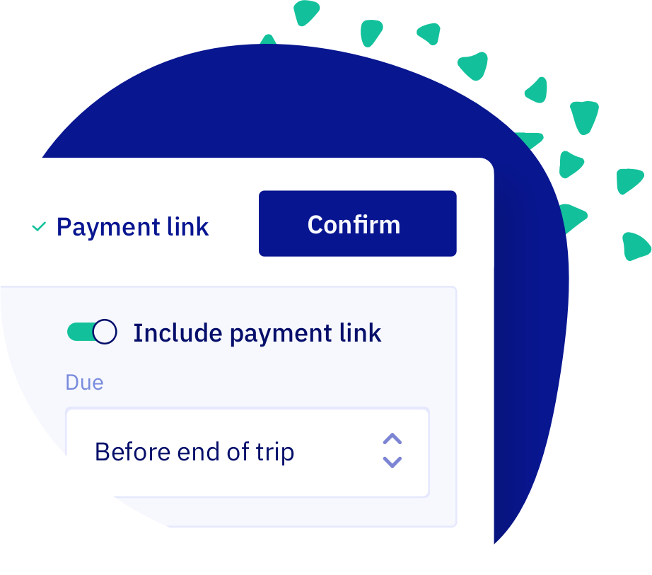

import Button from '@site/src/components/Button/Button';

# Faster confirms, smarter waivers

## A confirm button that follows you around

Confirming a draft booking used to mean scrolling to the right-column status card. The new **confirmation bar** sits pinned to the top of the booking detail page. It stays visible across every tab (Booking, Finance, Add-ons, Timeline), so you can finalize from anywhere.

Labels got a refresh too: clearer toggles (**Notify customer** and **Include payment link**), and the free-form payment deadline became four sensible presets: Before start of trip, Before end of trip (default), In 2 weeks, or Custom. Once you confirm, the bar disappears.

<Button href="/guides/day-to-day/bookings/add-booking#step-5-confirm-the-booking">
    Read the guide →
</Button>

## Waivers customers don't have to retype

Customers with the WaiverForever integration used to fill in data Let's Book already had: name, email, phone, dates, dock, boat model. Now you map WaiverForever fields to Let's Book variables once on the integration page, and every waiver arrives pre-filled.

While we were at it, the integration page rebuilds around a per-template setup card, and the **Documents to sign** card on Rental setup becomes a multi-select modal. Linking one waiver across multiple dock-boat combinations no longer feels like a chore.

<Button href="/guides/settings/waivers/set-up-waivers#prefill-fields">
    Set up waiver prefill →
</Button>

## Add-on pricing that flexes with the booking

Flat unit prices don't always cut it. Now you can price add-ons per boat (great for BBQ kits), per passenger (drinks), or per hour or per day per boat (heaters, captain service). Pick exact-time billing when fairness matters, or rounded-up days for simpler invoicing. The total recalculates automatically if booking details change.

<Button href="/guides/settings/create-add-ons/#pricing-methods">
    Set up add-on pricing →
</Button>

## Other updates

- **Sentinel Marine** joins our [hardware integrations](https://dashboard.letsbook.app/integrations/hardware) with one-click connect and automatic engine lock/unlock at trip start and end. Sentinel replaces Trackunit, which is being phased out.
- Customers now see the main booker's name on their booking detail page, as a subtle confirmation they're in the right place.
- The [planning overview](https://dashboard.letsbook.app/planning) now remembers your scroll position when you return from a booking, so you don't lose your place.
