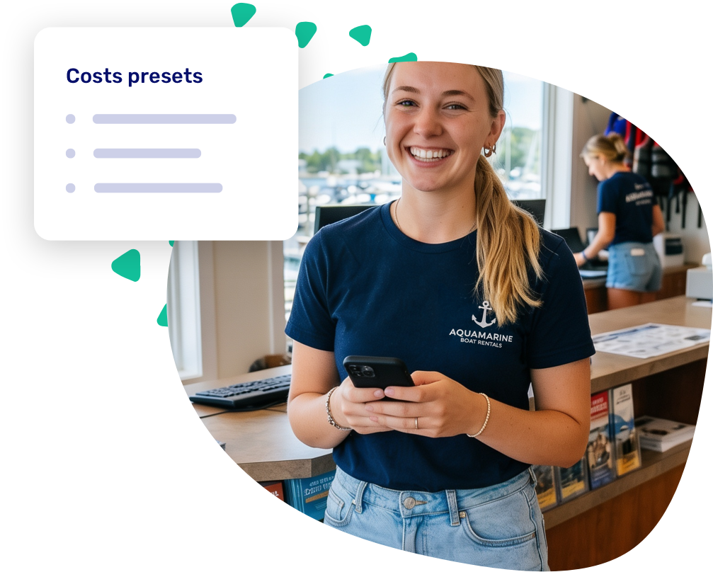

import Button from '@site/src/components/Button/Button';

# Costs and discounts, one click away

## No more retyping the same fees

You kept hand-filling the same cleaning fee, fuel charge, and loyalty discount on every booking. Now you save them once as **presets** and drop them onto a booking in a single click, with the description, amount, and tax already filled in.

Need a percentage instead of a fixed amount? The new percentage mode does the math against the booking total and shows you the result before you save.

<Button href="https://dashboard.letsbook.app/settings/cost-presets">
    Create presets →
</Button>
<Button href="/guides/settings/presets" variant="subtle">
    See how it works →
</Button>

## Other updates

- **Your booking timeline tracks more.** Booking notes, cash payments, and add-on changes now appear on the [activity timeline](/guides/day-to-day/tracking-changes), so you can see what changed, who did it, and when.
- **Cleaner [waiver prefill](/guides/settings/waivers/set-up-waivers#prefill-fields).** We took number fields out of waiver prefill mapping. They showed up with confusing labels and there was no real reason to map them, so removing them keeps your setup clear.
- We tightened security in a few places, including two-factor authentication and the customer login area.

## Bugfixes

- Fixed statistics not matching your dashboard after moving a boat to another location.
- Fixed bookings showing at the wrong time on the planning timeline when your docks span multiple timezones.
