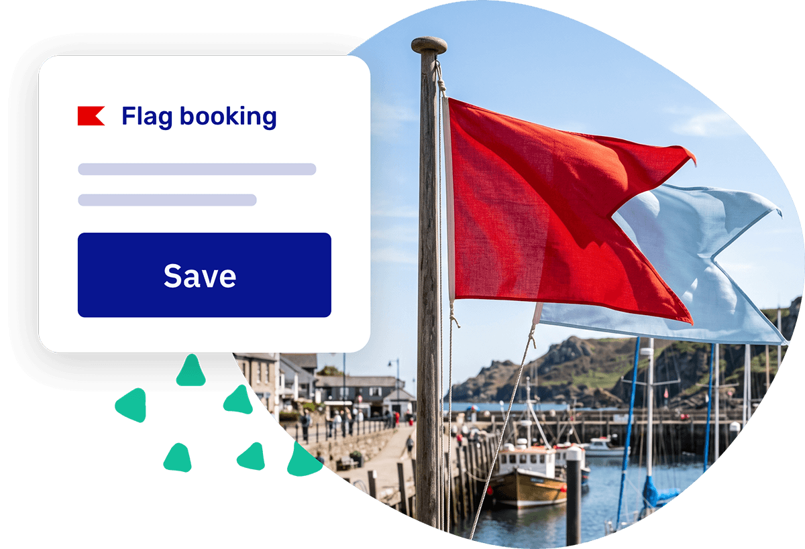

import Button from '@site/src/components/Button/Button';
import ContactSupportButton from '@site/src/components/ContactSupportButton/ContactSupportButton';

# Flag the bookings that need a second look

Some bookings need a closer look: a boat that came back with damage, a payment you still need to check, a request you want to confirm. Now you can put a **flag** on a booking as a signal to your team that it needs following up.

Add a note, flip the flag switch, and the booking stands out for your whole team, on the booking and across your overview. Clear it once it's sorted, so nothing slips through and nothing gets waved off too soon.

<Button href="/guides/day-to-day/bookings/flag-bookings">
    See how it works →
</Button>

## Coming soon: charge right at the counter, and we want testers

We're putting the finishing touches on **payment terminals**. Soon you'll be able to charge a booking and any extras you add to it straight on a card reader, so you never have to send anyone off to pay somewhere else. A remaining balance, a walk-in, or a drink someone grabs from your kiosk on the way out: add it to the booking and tap it off on the spot.

Want to be ready when it goes live? Order a card reader from [Mollie](https://www.mollie.com/products/pos-payments) or [Stripe](https://stripe.com/terminal/devices). With Mollie you can even use Tap to Pay straight from your own phone, so you can try it out without any extra hardware.

We're starting small with an early-birds test group before we open it up to everyone. Want to be one of the first to try it in your own business?

<ContactSupportButton>Send us a message →</ContactSupportButton>

## Other updates

- **Set margins per slot.** Give each slot its own buffer instead of one setting for the whole schedule. A multi-day charter can get plenty of changeover time while a quick two-hour trip gets just a little, and you can add that time before a slot, after it, or both. Great for cleaning, prep, inspection, or a late return. [Set it in your slot schedules](/guides/settings/rental-setups/schedules/slot-schedule#margins).
- **A fresh look for your overviews.** Your [add-ons](https://dashboard.letsbook.app/add-ons), [docks](https://dashboard.letsbook.app/docks), and [boat models](https://dashboard.letsbook.app/models) are now visual card grids with images, so you can spot the right one at a glance instead of scanning a list. Easy on the eyes, too.
- **Your own colors for customer types.** Give each [customer type](/guides/settings/customers/manage-customer-types) its own color so bookings and planning are easier to read at a glance. Your gold members can finally get the color they deserve.
- **Waivers show up right away.** The moment a booking is confirmed, the waiver is there, for you and for your customer, no waiting around.
- **A friendlier payment page.** Customers now see their own name on the payment link page, so it's clear they're in the right place.
- **Jump straight to customer details.** The customer section on a booking is now clickable, taking you right to their information.

## Bugfixes

- Fixed an issue where the navigation menu didn't always open the right section on certain pages.
