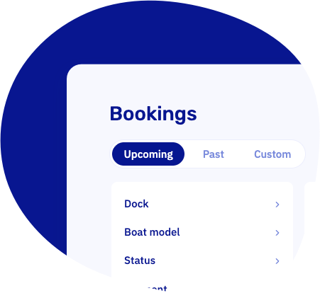

import Button from '@site/src/components/Button/Button';

# A fresh coat of paint for your bookings overview

The bookings overview you know, now smarter, faster, and easier to work with. Filters live in an always-visible rail on the left, and a bold Upcoming / Past switch with quick presets like Today and Next 7 days sits right above the list. Bookings are grouped by pick-up day under friendly headers like "Today" and "Tomorrow", so the questions you ask every morning get answered at a glance: what arrives today, and who still needs to pay?

Your filters even carry over into the page link, so you can share your exact view with a colleague.

<Button href="https://dashboard.letsbook.app/bookings">
    Open the bookings overview →
</Button>

## Know exactly what your customers received

Every booking email and text message now shows up on the booking's new Notifications tab: what was sent, when, and whether it actually arrived. If a message bounces, the booking gets marked on your overview and your dashboard warns you, so a typo in an email address never silently eats a confirmation again.

Fixing it takes one click: hit resend, correct the address if needed, and off it goes with the booking's current details. You can even see which notifications are scheduled to go out next.

<Button href="/guides/day-to-day/bookings/booking-notifications">
    See how it works →
</Button>

## Other updates

- **Tighter security all around.** We hardened sign-in, two-factor authentication, and the customer area following an internal security audit. Nothing you need to do, just extra locks on the doors.
- Various performance and reliability improvements under the hood.

## Bugfixes

- Boat models in the planning overview now follow the order you set on the models page, instead of doing their own thing.
- Resolved an issue where background tasks like emails could stall after a database hiccup.
