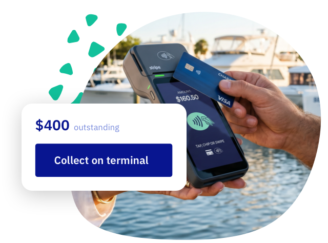

import Button from '@site/src/components/Button/Button';

# Charge right at the counter

Payment terminals are here. A remaining balance, a walk-in, or a drink someone grabs on the way out: add it to the booking and tap it off on a card reader, so nobody gets sent off to pay somewhere else. You follow the payment live on screen, and it lands on the booking like any other.

Order a reader from Mollie or Stripe and you're in business. With Mollie you can even skip the hardware and use Tap to Pay straight from your own phone.

<Button href="/guides/settings/payments/terminals">
    Get started with terminals →
</Button>

## Other updates

- **Collect a payment, your way.** One [Collect payment button](/guides/day-to-day/bookings/manage-booking-finances#collect-a-payment) on the booking now covers it all: charge the card on file, take it on your terminal, or send a payment link. Pick the method, the rest is pre-filled.
- **Margins, per booking.** The turnaround [margins](/guides/settings/rental-setups/schedules/slot-schedule#margins) from your schedule are now editable on each booking. That one charter that needs extra cleaning time gets it, without touching your schedule.
- **Flags fly on the planning.** Flagged bookings show a pennant right on the booking bar, so they catch your eye without opening anything. And on the booking itself, notes now open right away, flags included.
- **Find any booking.** Search now looks across all your bookings instead of just the current view, and when a filtered search comes up empty, one click searches without filters.
- **Update emails that show the update.** The booking-updated email can now list exactly what changed, old and new side by side, so customers don't have to spot the difference themselves.
- **Quieter inboxes, if you want.** You can now turn off booking-update emails to customers for your whole account, in your [general settings](https://dashboard.letsbook.app/general-info).
- **A separate technical contact.** Point technical notifications at your tech person instead of the general inbox, in your [general settings](https://dashboard.letsbook.app/general-info).
- **Additional charges, your order.** Drag the additional charges on a pricing into the order you want, no more deleting and re-adding.
- **New accounts ask for a phone number.** Almost everyone wants one for last-minute changes, so it's now the default for new booking forms. Your own [phone number setting](https://dashboard.letsbook.app/booking-form/phone-number-requirement) stays exactly as you left it.
- **A status page for the "is it just me?" moments.** Bookmark [status.letsbook.app](https://status.letsbook.app/): if Let's Book ever feels slow or unreachable, you'll see right there what's going on.
- **Stronger sign-in security.** Signing in got a serious round of hardening behind the scenes, from two-factor authentication to login throttling. Your phone now offers to fill in the SMS code, too, so no more app switching.
- Various performance and reliability improvements under the hood.

## Bugfixes

- Cancelled bookings now keep their add-on orders and charges visible, so you can check what was ordered and refund the right amount.
- The signed-documents icon found its way back to the bookings overview.
- Switching the planning overview from monthly to daily view behaves properly again.
- Add-on translations keep their line breaks and layout instead of collapsing into one block of text.
- Polished a handful of small things, from the add-ons rearrange screen to the date picker in the booking form.
